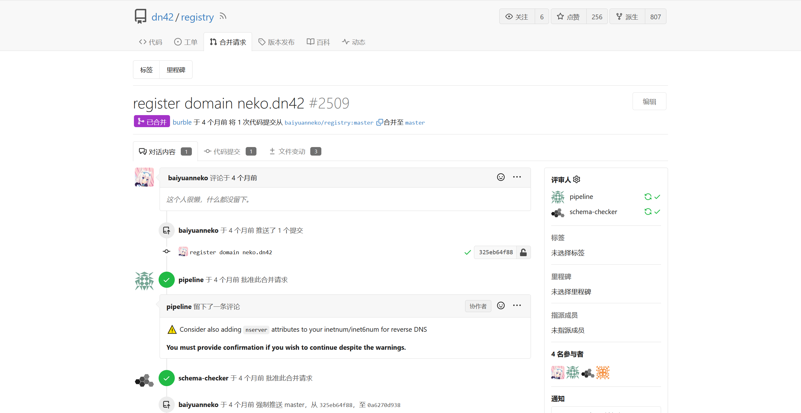

距离我上次写博客已经隔了将近五个月的时间了，我这段时间不更新的原因其实是 ~~单纯就是懒得写（误）~~ 一方面我这几个月确实没特别钻研过什么复杂的东西，水平也不到位，虽然可以「为了让自己的博客看上去充实而作为一个自己也刚入门某个东西的人还要去写一篇类似XX入门指南的东西」，但是我自己是不想这么做，而写写自己的生活或者评析一下看过的动画/玩过的Galgame这种文章我写起来也没有之前写这类文章的那种感觉了。我试着推理一下可能的原因，其实现在这个博客刚刚建立是在2021年的8月份，从这个时间一直到去年的7月份就是我上高三的时间，那段时间里在各种大考小考中写了无数篇议论文，虽然挺累的，但是这种频繁的训练大概也激发了我写点什么东西的冲动，而到了现在我就变懒了，乐。

下面我就随便说说这几个月里我觉得值得说一说的事情。

## 开始使用 YubiKey

三月份的时候 [Misaka13514](https://i.atri.tk/) 送了我一个 YubiKey 5C NFC，从此就开始了我使用 YubiKey 的经历。那么什么是 YubiKey 呢？请看下面的介绍。

> YubiKey是由Yubico生产的身份认证设备，支持一次性密码（OTP）、公钥加密和身份认证，以及由FIDO联盟（FIDO U2F）开发的通用第二因素（U2F）协议。它让用户可以透过提交一次性密码或是使用设备产生的公开/私密金钥来安全地登录自己的帐户。针对不支持一次性密码的网站，YubiKey也可以存储静态密码。Facebook使用YubiKey作为员工凭证；Google同时为雇员和用户提供支持。还有一些密码管理器也支持YubiKey。
> --- 维基百科<ref url="https://zh.wikipedia.org/wiki/YubiKey">YubiKey - 维基百科</ref>

我入门 YubiKey 的时候除了官方的教程，主要参考的文章是这一篇：

* [开始使用 YubiKey | Yuanji's Blog](https://blog.gimo.me/posts/getting-started-with-yubikey/)

我目前使用 YubiKey 的用途有两个，一个是将其作为网站的两步验证因素之一，另一个是用它来存储自己的 OpenPGP 私钥。对于两步验证和 OpenPGP 这两个概念不在这里过多介绍，简单来说前者指的是在登录网站账户的时候除了账户密码还同时要求另一个方式来验证，后者比较复杂，如果你完全不知道的话可以看[这个来自维基百科的链接](https://zh.wikipedia.org/wiki/PGP)做进一步了解。

<info-hint>虽然不用 YubiKey 这样的硬件安全密钥也可以设置两步验证或者比较安全的存储 OpenPGP 私钥，但是实际上在做这些事的时候 YubiKey 比传统方式安全得多。因为不管是 TOTP 还是 FIDO U2F 还是使用 GPG 加密/解密/签名文件，传统方式都必须要将 TOTP 私钥 / OpenPGP 私钥 / 其它各种类型的私钥存储在设备本地，如果相关应用没有妥善地存储私钥（比如不加密/加密方式极其简单/加密所用的密钥泄露）就有可能被恶意软件窃取。而对于 YubiKey 来说私钥一旦被导入 YubiKey 中就无法再次读出，确保了私钥不会泄露。<ref url="https://developers.yubico.com/U2F/Protocol_details/Key_generation.html">Key generation</ref><ref url="https://support.yubico.com/hc/en-us/articles/360013790259-Using-Your-YubiKey-with-OpenPGP">Using Your YubiKey with OpenPGP - Yubico</ref><ref url="https://developers.yubico.com/OATH/">OATH</ref></info-hint>

具体到我的使用体验上，一方面我想说的是**自己在 YubiKey 上设置的 PIN 一定要牢记**~~（关于我忘记了自己两个月前为 YubiKey 的 OpenPGP 功能设置的 PIN 这件事（还好之前备份过私钥文件，重新导入回来了））~~，另一方面就是要把 YubiKey 放在一个你认为合适的位置（要兼顾安全性和方便性），当然更不要随便乱放导致弄丢。

## 游戏

### 原神

原神是我四月份刚刚开始玩的，玩到现在玩了差不多一个多月吧。感觉还是挺好玩的，在我玩过的游戏当中算是比较好玩的那一类。

游戏的类型是 RPG，我玩过的 RPG 不多，但是感觉原神和我记忆里的 RPG 游戏从玩法上差不多（有主线剧情任务（魔神任务）和支线任务）。单从任务系统的设计上来说，我还挺喜欢它的角色支线任务的设置（好像叫传说任务），这种任务的玩法有点类似 Galgame 和 RPG 的结合体，有多结局和流程图以及结局的 CG，也可以重复进行从而达成所有结局，我目前玩了芭芭拉的角色支线任务，感觉和 Galgame 差不多。如果角色和剧情多一点就好了。其它支线任务有一个缺点就是接了之后不能取消，我最近才发现，结果就导致主线剧情有时会因为支线任务没做完而无法继续。我玩到现在主线和支线的剧情感觉还是不错的，有些剧情还是挺有趣的，也有的剧情挺感人的。

每日委托实在有点太千篇一律了，我不是很喜欢，以至于有的时候我即使登录游戏也懒得做每日委托。

从战斗系统上来说，其实这方面我玩的不怎么样。原因之一是因为我不氪金，所以抽到的角色和武器也不多，而在我抽到的角色中符合我审美的就更少了。而我又很希望一个队伍里都是我所喜欢的角色，所以队伍搭配和战斗能力可能都不是很好。

下个版本有一个新的猫耳娘角色（绮良良），感觉还挺好看的，虽然没有到特别特别喜欢的程度，但还是希望到时候可以抽到。

### 雀魂麻将

虽然已经了解玩法并入门，但是我大概不会继续玩下去，原因是这个麻将一局的时间感觉不太确定，有时候会拖到很久，太占时间了。

### Minecraft

这几个月里确实玩的不多，除了 23w13a_or_b 那个快照更新的时候重新玩了一下。

## DN42

在学习 DN42 的过程中学习了 WireGuard 和 BIRD2 等软件的使用，过程中踩了不少坑，感谢 [Misaka13514](https://i.atri.tk/) 孜孜不倦的指导。

P.S. 我注册 DN42 域名的时候竟然发现 [neko.dn42](https://neko.dn42/) 这个域名还没有被注册于是直接注册了，成功拿到，好耶！

## CTF

今年三月份的时候参加了一场线下的 CTF。这次比赛组队是每个学校组几个队，而我很幸运地和两个大佬组在了一队，我就做了个签到题和一道最简单的 Misc 题。

参加之前低估了这次比赛的难度，本来还是有机会多做出一道 Pwn 的题目的，可惜解法我是在最后的时间想到的，以至于没有时间进行验证和作答了。

虽然最后还是拿奖了，不过 CTF 的分确实不高。

## AI 相关

### GitHub Copilot

前几天向一个同学问了一下我学校的 edu 邮箱是怎么登录的，然后用这个 edu 邮箱去申请了一下 GitHub 的 Student Pack。这个 Student Pack 里我最用得着的其实就是 GitHub Copilot，别的我到目前为止还没怎么用。

我此前用过 Tabnine 的免费版和 AWS 的 CodeWhisperer。前者好像是只能单行补全的，但是因为我很长一段时间里没有找到它的替代品（虽然那段时间 Copilot 已经出了但是我那时候还没整明白学校的 edu 邮箱怎么登录）所以忍受着 Tabnine 免费版用了很久，也不好用。后来四月份的时候 AWS 出了 Copilot 的竞品 CodeWhisperer，凑合着一直用着，效果也还行。直到前两天终于换上了 GitHub Copilot，感觉不管是上下文的理解还是补全的正确性都比 Tabnine 免费版和 CodeWhisperer 强了一大截。

### New Bing

New Bing 刚开始用的时候感觉还是挺新鲜的，但是我目前还是手动用 Google 搜索东西更多一点。

### 大语言模型

某一天刷知乎的时候这篇文章吸引了我的注意：

* [rwkv.cpp: CPU 也能跑的 RNN 中文语言大模型](https://zhuanlan.zhihu.com/p/623648932)

反正也没什么事，就随便玩了玩。用的是 [这个](https://huggingface.co/BlinkDL/rwkv-4-raven/tree/main) 里面的一个模型。虽然效果明显远远不如 ChatGPT，不过比我一开始想象的还是要好一点，~~还有最重要的是可以扮猫娘~~。

同时在使用中发现了一个小问题，于是顺便开了个 PR 解决了。

* [Fix encoding issue when loading prompt data by baiyuanneko · Pull Request #58 · saharNooby/rwkv.cpp](https://github.com/saharNooby/rwkv.cpp/pull/58)

## 计算机相关

计算机语言方面，试着学习了 C#，并写了一个小项目来练手（虽然没完工）。目前还学的不是很深入，不过在这个过程中对面向对象程序设计有了更深入的理解。

## 动画和 Galgame

从三月份以来其实没怎么玩过 Galgame。除了五月份的时候玩了个[《零岁的星光》](https://store.steampowered.com/app/2114770/)，最近我是在推[《天使☆騒々 RE-BOOT!》](https://bgm.tv/subject/409483)。

三月份以及从今年一月份到三月份之前中我推过的 Galgame 中比较喜欢的是[《樱之诗》](https://bgm.tv/subject/22423)和[《青空下的加缪》](https://bgm.tv/subject/257527)。

喜欢《樱之诗》的原因是觉得各个方面都挺不错的。和很多人相反，我其实是挺喜欢《樱之诗》的这种描绘日常的风格的，觉得有一种闲适自然（？）的感觉，当然每个人对作品的品味都不一样。游戏的整个气氛也挺美的，玩着很放松很舒服。音乐/BGM当中也有几首让我觉得很好听，也单曲循环了一阵子。下面列举几首：（链接均指向网易云音乐）

* [舞い上がる因果交流のひかり](https://music.163.com/song?id=399367366)
* [瞬間を閉じ込めた永遠](https://music.163.com/song?id=399367367)
* [螺旋に伸びる色彩](https://music.163.com/song?id=399366411)

<warning-hint>这里提示一下在 Linux 下想要用 Wine 来运行《樱之诗》的人：这个游戏用原版 Wine 运行的话在某一段剧情会卡死崩溃。如果遇到了可以换用 Proton 运行时来运行。</warning-hint>

喜欢《青空下的加缪》一方面是因为气氛很美，作画也很精美，另一方面剧情至少我觉得很感人。结局有点遗憾，不过从整个故事的角度来看也是一种必然。

动画方面就挑几部我这几个月看的又很喜欢的动画来评价吧。

首先是《虚构推理》。Bangumi 上这部的评分好像不是很高，但是我自己还是很喜欢的：我觉得这部番的女主（[岩永琴子](https://bgm.tv/character/66614)）很好看，在性格上又很有特点；这部番的整体画风还不错；故事背景、具体情节和故事主题从整体来讲都比较对我的胃口。这部番和《冰菓》给我的感觉不太相同，但我觉得它比《冰菓》还要更有意思一些（也许一个原因是我对千反田爱榴完全无感，但是这部番的女主还挺有趣的）。

其次是《天使降临到我身边》，OP 和 ED 都很好听！（不过我更喜欢 ED 一点）

目前我正在看的动画是[《【推しの子】》](https://bgm.tv/subject/386809)和[《とらドラ！》](https://bgm.tv/subject/909)。