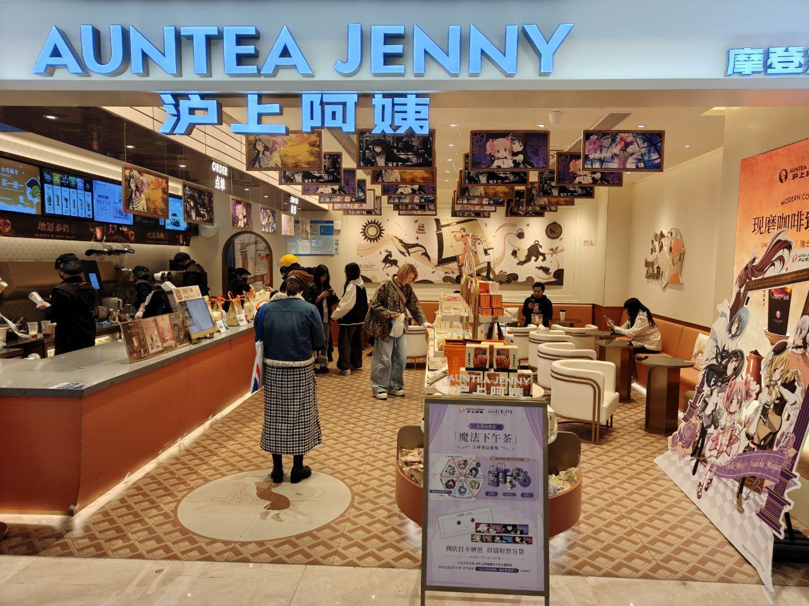
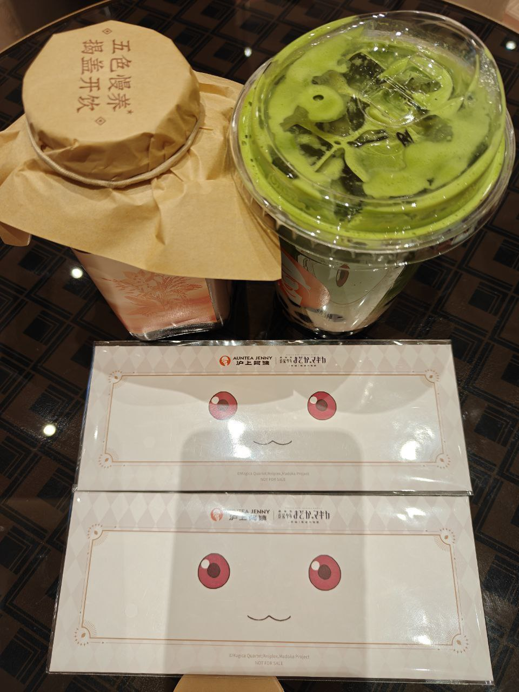
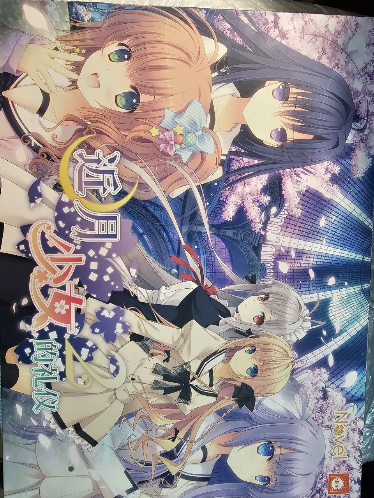

对我来说今年发生了很多事，就采用倒叙的手法，慢慢从我能记得起来的事情开始回忆罢！

首先是最近打的给木《魔法少女的魔女审判》。这也是我今年唯一玩的两个勉强能算是Galgame的游戏之一。另一个是《米塔》。这两部游戏给我的印象都蛮深刻的。

首先来说说《魔审》吧。这是一部 Unity 引擎制作的，主体为视觉小说，或者说 Galgame 的游戏作品。你作为13名被人类认为“危险”而被关押的魔法少女之一，一起被关押在一个举目无人的小岛里。岛上有各种看守和怪物，阻止你的逃离。魔法少女最终的结局就是成为魔女，而魔女会有杀人的冲动，所以这个岛上会定期发生由其他魔法少女导致的凶杀案。每次发生凶杀案，要经过一个称之为审判的过程，找出那个杀人的魔法少女同伴，并且对她进行处刑（杀死）。这个游戏的精彩之处我认为主要在于对审判时，少女们心理的刻画和描写；以及所谓的女女关系性，也就是类似 MyGO 那样的炒 CP，搞女同等等。我以前是从来没有玩过审判或者如此硬核的推理题材的游戏，不过看过《魔圆》这部题材类似的作品，所以对这部作品的设定接受的还算快。而对于审判庭相关的设定，我是第一次接受，然后觉得还挺有意思的。

我个人玩过通关之后，是非常喜欢这部游戏的。首先就是里面的很多角色都很很可爱很有特色，性格鲜明，让我一下子就喜欢上了其中的几位。比如“蓝头发小女孩”雪莉，虽然很容易冲动，但是这也是她的萌点。以及主角艾玛，虽然看起来比较柔弱，但是实际的推理过程是一直在C，很坚强。另外，这部作品之间有很多比较好磕的cp，她们的感情让我动容，尤其是雪莉和汉娜、希罗和艾玛。看到二周目雪莉冲过去抱住汉娜的那段的时候，给我感动的不行。

其实我今年除了这两部作品之外，还试图玩过很多galgame，但是为什么我说“试图”呢，因为我发现其实很多我以前理论上是能玩下去的 Galgame，现在对我来说已经兴致缺缺了。比如柚子社的那个 LimeLight 乐队新作，以前我估计是有耐心推的，但是现在的话只觉得——好无聊好无聊好无聊。甚至，我一度认为我电子阳痿了（雾），但是很幸运的是《魔审》证明并不是这样的。我先是看了一些自媒体关于这部游戏的报道，有了个初步的印象，但是一直没下定决心去花时间玩，后来了解到了这主要是一个 Galgame，我才尝试去玩，并且本来担心的游戏难度过大并没有发生。大部分审判都不难，对我一个这方面完全是小白的人都非常友好，尤其是大部分答案都能通过穷举法获得这点。（x 总而言之这部作品一下子让我沉浸其中了。

其实之前和朋友一起看《魔圆》的时候，我一开始完全没被剧透过任何东西，还以为是一部普通的健康阳光的欢乐剧本，然后看到学姐的头被吃掉的时候直接震惊了。不过那时候我对这种黑暗魔法少女的题材只是食髓知味，并没有细节地细究这部作品带给我的震撼，而是只作为一部有特色的作品来看待，但是现在与这种题材再会，结合最近一些自己在生活上的经历，感觉又有些新的理解。

首先是对于日常生活中“痛苦”的接受。以前看 EVA 的时候就有人说过，如果一个被保护的很好的人，他看EVA是看不下去的，因为其中的痛苦他实际上理解不能，而其中的情节在逐渐体会到生活的艰难和痛苦的时候才能被体会到并且慢慢地理解其中内涵。对我来说，平常最大的挫折的来源是我从找工作到实习开始的这段工作经历。当然客观的说，这只是挫折，并且程度可能比很多人想象的要轻。毕竟工作本来就不是愉快的事情，这也没什么可凡尔赛的，对任何人来说都是如此，何况我体验到的挫折程度估计比很多人还是要轻的。

客观来说我其实是一个比较有自信的人，但是找实习时候的市场行情狠狠地打了我的脸，首先我一开始想的比较简单，觉得中厂大厂对我来说应该没什么问题，于是直接投递了一些中厂大厂，包括使用了一些群友/网友中得到的内推码之类的方式，并且按照要求做了很多调查问卷、心理测试之类的必要工作，不过最终发现还是完全没有中厂/大厂理我。不过好在我的优点之一是接受能力强，当发现这一点的时候，我意识到目前如果继续保持高要求，对于“找到工作”这个目标来说没什么用，所以只能更换策略还是在BOSS直聘上面慢慢找慢慢沟通，发现还是有很多小公司愿意做面试之类的沟通的。最后目前是进入了一家 Java 和 React 技术栈的做人工智能相关应用的小企业。

面试各家企业的过程当中给我遇到的一个很难崩的经历之一是来源于我的第一次面试，是投了一家小公司，他们要做的项目是一个类似于证券分析的软件系统。然后先是问了我有没有Neo4j的相关经验（事后了解到是一种图数据库），然后问我有没有了解过图数据库，我肯定是都没有的。然后问了些基础的和进阶的面试常见问题，比如我印象很深刻的一道是问我 MySQL 单张数据表能存储多少数据，我回答说两千万，结果对面问我为什么是这个数值。其实我也不知道，只是之前忘了什么时候从网上听说了一种说法是这样的，结果对面就问我为什么是这个数值，我一时间也没想起来，结果对面就说其实它也不知道，只是想诈诈我看看我的知识边界在哪里，就挺抽象的。

然后就是 LeetCode 算法题拷打了，关键是...我从来没刷过什么算法题，一开始让我写了个广度优先搜索获取树的宽度，我说这个对我来说太难了，能不能改成深度优先搜索获取树的深度，结果主要的递归写出来了，但是有个小细节处理还是有问题，毕竟没有什么调试环境我也没运行过，没有第一时间发现，结果对面就直接说我的算法水平太弱了，如果算法水平不够，就不要在简历上写算法相关的内容了（因为我写了个蓝桥杯省赛二等奖上去）。此外，我平常学习的框架都是烂大街的东西，什么Spring Boot、Vue和 Flask 之类根本不重要，我实际的计算机基础知识很薄弱，我能做的事情大街上随便拉个人培训半个月也能做。我当时就很难过，几乎是要哭出来的程度，也有点急了，立刻反驳道工程上也有很多问题要解决，软件开发不是只有算法的，并且举了个例子是处理数据库的脏数据，这点需要写定时任务和脚本来发现可能存在的问题并修复，问了下对面能否多出些实际开发/工程相关的题目，结果对面说他不熟悉实际工程，只能多问些算法题目了。我另外反驳了我计算机基础知识薄弱这一点，毕竟实际上我还打过 Hackergame 和 GeekGame 呢，说我计算机基础知识差对我来说简直是一种羞辱，我自己反正是肯定不承认的。结果对面问了我如何解决 UDP 的“粘包”问题，我听说过但是没研究过，只能说我也没法把整本书给背下来对不对，这种事情为什么不能用到了再查呢？对面还说面试他们公司的有中科大少年班的blabla...那你让我和真正的人才去比，那还说啥呢...总之最后遗憾退场。毕竟作为第一场面试来说如此大的失败对我打击确实有点大。

但是现在在另一家企业工作一段时间之后，回头来看，我的结论是面试并不是一件值得如此浪费感情的事情，只是一开始我由于是第一次找工作，对这种事过于敏感了，所以对我产生了比较大的打击。实际上，一方面，面试本身就是双向选择的过程，如果对面问的东西和你的知识范围本身重合度就不高，本身就是有问题的，说明对面（预期中的对你的）的岗位要求和你自己的匹配程度很可能本身就不高。在这种情况下，就不必强求了，既然本来就不适合对应的岗位，强行进入也没什么好的后果。尤其是如果是在大城市找工作，其实程序员匹配的岗位还是很多的，能选择的技术栈也很多，包括 Java、Python、Go、Vue、前端、后端、全栈等等，总能找到一个技术栈匹配也合适的岗位。一时间找不到不代表一辈子找不到，多等几个月，可能会有更好的机会。另一方面，因此，没必要和面试官争论什么。我一开始就是做题家思维，把面试当成了考试，总是尝试去迎合面试官给出的问题，一旦答不出来就伤心难过，这其实是根本没有必要的。如果实在对面的很多问题都回答不出来，那就换下家公司，下一场面试，不用陷入自责或者难过之中。

除此之外还有个人的选择问题。一开始我总是眼高手低，总觉得自己能进入大公司，但是实际上大公司对学历的要求会比较高，而我是处于一个相对普通的本科院校，本身就比较困难。另外，还是要明确找实习的意义是什么？希望从中学到什么？对我来说我找实习的理由其实是我的室友。有次我们寝室晚上聊天的时候，我说自己在玩 React Native 开发手机应用，结果他来了一句说觉得这比较无聊了，别的人上进的现在已经找好实习找好工作了。言下之意，我平常玩耍的技术如果无法变现就没有意义。然后我的胜负欲（？）一下子就上来了。怎么说呢，一方面，我想证明我玩耍的东西是有趣的有意义和价值的。用前途或者什么未来工资发展之类的东西来衡量我对技术的喜爱，我觉得是一种矮化。另一方面，我想证明对于喜欢技术的人来说，用它来谋生并非一件难事。非常幸运的是，我觉得我现在已经做到了这两点。

扯远了，还是回到对于“目的”的讨论上来。对我来说找实习的原因可以总结为对真正毕业后找工作的预演。除此之外，对于找工作来说，通常的考虑因素还包括：工资、工作环境、工作时间、通勤时间...等等。不少大公司往往有加班严重的问题，甚至有些可以说是在“拿命换钱”。诚然很多大公司有更高的工资，对自身成长也更为有利，但是考虑到其他因素，是否真的值得呢？再者很多事情其实是一体两面的。大公司有完备的运维体系，包括私有 Maven 仓库、Docker 私有镜像站之类，但是这也意味着很多基础设施已经被搭建完成，作为开发仅能学习到开发相关的知识，作为运维仅能学习到运维相关的知识，这样真的能说是对个人成长有利吗？此外，小公司下每个员工可以做的决策更多，虽然要承担的职责也更多，但这未必对个人发展是不利的。考虑清楚这几点，实习是否要去大公司，我认为是需要谨慎考虑才能下的决定。说到底，本来就是当牛马的，即使是在大公司，也是做牛马，不必迷信大公司的光环和头衔之类。

说回《魔审》。我觉得包括《魔圆》在内，其与现实存在比喻关系的一个设定之一就是“灵魂宝石”/“魔女化”。生活本身是一件艰辛的事情，而压力/创伤性事件属于对人动力的一种磨损，这对应的是《魔圆》中的“灵魂宝石磨损”到“魔女化”。这种压力的来源其实可以是多种多样的，远远不止工作产生的压力，还包括比如和别人的关系处的不好，或者因为焦虑而害怕不好的事情会发生，因为这种原因而感到疲惫积累起来，对人的影响是巨大的。这跟人的注意力也是有很大关系，毕竟 Attention is ...（逃）（x 很多时候通过娱乐，或者游戏之类的，就可以缓解这种压力，暂时从对压力的注意力中逃避出来。总而言之跟生活打架本身就是一个很困难的事情，反正我现在是深深地体会到了。

还有一个是《魔审》中辩论和审问的形式最近也让我感觉和现实生活中的一些场景有相似之处。比如我和同事在联调一起找问题的时候，就很有种在玩魔审的感觉。比如找出系统输出日志之中细微的可疑之处，然后点击进去提出反问。最后豁然开朗发现最终问题的那一刻仿佛听到了镜子的碎裂声，就很有感觉。

再来说说《米塔》吧。《米塔》是我今年年初时候玩的一个心理恐怖游戏。玩这个的理由一个是这个游戏对配置要求很低，也很容易 Wine，是3D游戏，而且有一些元游戏和模拟恐怖的元素，同时二创很多，所以吸引了我尝试的欲望。然后玩过之后发现也确实还不错。

米塔的优点我觉得一是优化很好。虽然是3D游戏，但是它是采取了一个相对柔和的画风，而且没有复杂的特效和场景，基本上是做到了在效果和配置需求之间的平衡。我的核显在高画质下都能基本达到60帧。而且画面看起来质感还不错，虽然简单，但不简陋。第二个就是尚可的剧情配合作者“元游戏”的各种巧思了。米塔的外壳就像一个廉价的巧克力雪糕的外壳，看上去好看，但是你仿佛都能想象到它内核的味道，吃了很多次巧克力雪糕的你已经感到有些厌倦了，但正好你又不知道买什么于是打算随便试试。结果发现里面还有香草、柠檬等各种意想不到的味道，这些小小的彩蛋或者说巧思是我喜欢这部游戏的原因之一。换而言之米塔自己的主线剧情设计我觉得反而是相对平庸的，但是其中对各种米塔角色性格的刻画、心理恐怖氛围的渲染，以及穿插的各个彩蛋和“沉浸式设计”的巧思绝对是酒香不怕巷子深的存在。

首先是角色性格。游戏中有很多种不同的米塔，包括善良米塔、帽子米塔等等，虽然长得大致一样，但是在外貌上仍然做了细小的区分，同时不同的语气和性格也能明显让你分辨出不同的“米塔”，让你感受到她们也有自己的思维和感情，而且是有区别的不同的人。同时这部作品在节奏设计上和《魔审》也是类似的思路，就是恐怖场景和日常场景的穿插交替。记得以前听说过有一种表白技巧是，不要一上来就说喜欢，而是先把两个人放进一个会让人心跳加速的情境里。比如你约她去走一座看起来有点摇晃、挺高的吊桥。她一路上会紧张、害怕，手心出汗、心跳加快。等走到对岸，身体的那股“心跳加速”的余波还在，她的大脑会下意识把这种强烈的生理唤起，归因到“和你在一起”的感觉上，于是更容易产生“我好像对他心动了”的错觉。换句话说，危险带来的紧张和兴奋，被误认成了爱情的悸动，从而起到推波助澜的作用。而《魔审》和《米塔》我觉得都是很好的应用了这种心理，在微妙的紧张感和CP互扣（雾）之间取得了一个平衡。这也是我为什么喜欢末世/科幻类题材的Galgame，因为在这种特殊的情境下，人和人之间的感情才更真挚和纯粹。

除此之外就是《米塔》制作组中间穿插的很多巧思了。比如在接近结局有一个类似于铁丝网和高塔的地方，忘了是哪里了，会有连续几个地点摆放着游戏机。里面的游戏都是经典的游戏，虽然玩法都很简单，但是我记得都是有对经典游戏的致敬，而且游戏的内容都很符合当时的情境。同时高塔和铁丝网那块的那几个场景渲染的也很好看，包括有个米塔站在高高的楼梯上往下看着玩家的一个场景，就很有感觉。还有游戏中有不少环节的场景都是采用了蒸汽波风格的交互和视觉设计，比如有一处花瓶还是什么物品，点击交互之后他的上面会冒出很多 Win95 风格的错误提示，让我看到之后就感觉有种对上电波的感觉。

说到场景，我觉得《米塔》的场景搭建确实做得不错，很多场景都很有感觉。说起来有空的时候还打算玩玩 Misaka13514 推荐给我的《When the darkness comes》，这也是一部心理恐怖游戏。我很喜欢视觉小说，包括其他游戏，我觉得他们的意义就在于当我品鉴游戏内的剧情，代入进去，去跳脱到现实生活之外去思考另一个世界的爱恨情仇和价值选择，真的能给我带来很多思考和启发，游戏被称为“第九艺术”真的不是没有道理的。

了解我的人都知道，我今年已经大四了，即将进入社会的殿堂。回头来看只觉得大学生活过得很快，很多事情我都已经没有准备好就发生了。比如我找实习的时候是今年大概五月份的时候正式开始投简历，然后一开始我还幻想着要不要找个一周只工作3～4天的实习，后来发现找不到之后之后改成五天，然后一开始也没有预料到工作是如此累人的一件事，像是在刚刚开始上班的那几周里面，我还有心情去离单位步行需要半小时的公园里面偷偷溜出去走走，后来工作强度上来之后就慢慢地被磨掉了这种想法，只想一天都待在楼里面，因为走路也是消耗体力的事情，会让我感觉很累。还有就是加班。第一次加班半推半就并没有拒绝掉，然后之后发现其实对于打工人来说加班是件稀松平常的事情，虽然不是每天都加，但是在需要的时候，也是会偶尔有的。我开始实习是在六月中旬，而到了九月，开学的时候，不知不觉已经实习了三个月了，这中间有痛苦高压和迷茫的时候，也有开心兴奋和喜悦的时候。而当我再次回到学校的时候，却没有预想到自己会突然就emo，正如同《莫愁乡》中的“几度梦回莫愁乡”，才发现大学的时光其实是多么的宝贵，完成作业和上课的课业压力其实远比工作的压力小得多，而和同学们纯粹的在一起开心玩耍的时间也是难得的。回到学校后的第一个晚上，我思绪万千，忍不住在学校里面散步了整整一个小时，脑海中循环着《誰にもなれない私だから》，去细细品味那些我平常经常走过却没有注意过的地点和细节。我一开始认为自己的emo是由于近乡情怯的感情所致，后来发现自己可能只是怀念无忧无虑的玩耍的时间。大学时间真的是人生最自由的一段时间，而在毕业之后，人们必须思考出路，例如出国、考研或者直接就业。首先是出国：我大一和大二的时候曾经思考过出国的可能性，但是后来慢慢放弃了这种想法，一是出国很昂贵，二是我的心思其实很少放在学习上，绩点平平，还有个原因是我其实不太管得住自己，像是出国需要背的英语单词我都坚持不下去去背。其次是考研，我是不喜欢像高考那样的去学习，所以也排除，到最后也只有直接就业一条路，去直面人生的挑战。尽管这条路是艰辛的，但是我认为自己是可以克服这些挑战的。

很感谢今年身边的很多人对我的陪伴，你们都是我的翅膀！（x）我今年最开心的几个经历也都和这些朋友们有关，一次是和 Misaka13514 一起去吃的拉面、一起去逛的《魔圆》和沪上阿姨的联动店；一次是被 BrightSu 送了很多的周边和实体gal，还有就是七月份的时候和mzw、chi、Rikki等等群友的面积。

↑ ep.12 わたしの、最高の友達！

↑ BrightSu 赠送的很多周边礼物之一：《近月少女的礼仪2》

以上就是所有的照片了。虽然这次的博客内容可能不多，也没有展示很多照片，但是我觉得真挚的感情不需要复杂的证明，而是互相的记忆、从回忆中回味到的喜悦。尽管这段文字没有热烈的语调，但你我都知道彼此的内心是炽热的。

再次感谢所有群友和朋友过去、现在、未来的陪伴：[Misaka13514](https://blog.apeiria.net)、[scientificworld](https://blog.koishi514.moe)、[chihuo2104](https://blog.chihuo2104.dev)、[BrightSu](https://www.brightsu.cn)、[Rikki](https://https://github.com/Rikki-Zero)、[666999HC](https://space.bilibili.com/516252009/)、[Muji Togawa](https://blog.mjt.asia/)、[littlebear](https://github.com/Fisherman110)、[Ray](https://mk1.io/)、[wlt233](https://tqlwsl.moe/)、[mzwing](https://mzwing.eu.org/)、[zzjzxq33](https://blog.akuamar1n.com/)、[dabao1955](https://sekaimoe.dpkg123.site/)。祝所有朋友和正在看这篇博客的人新年快乐，一切顺利！

## See Also

* [2025年度总结 - chihuo2104の部落格](https://blog.chihuo2104.dev/posts/goodbye-2025/)
* [碎记 · 一个简单的2025总结 - 洛仙璃の幻梦](https://mzwing.eu.org/index.html?type=article&filename=2026.md)