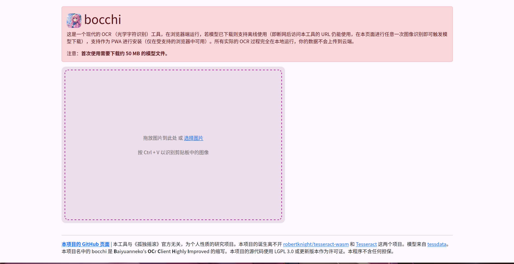
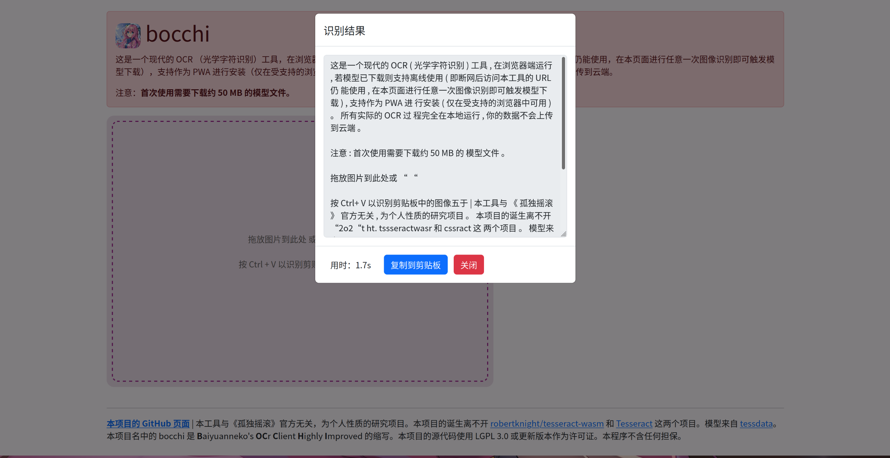

想特别地缅怀（雾）一下我之前进行的比较失败的 Web 端离线 OCR 尝试。

想做这个的起因是因为虽然网页端有很多在线 OCR 的，但是它们大多数都是上传到服务器端进行的。即使它写了服务器端不会保存你的图像数据，不过这种事谁说得准呢（）于是就开始了我的折腾。首先这种场景大概率是要用到 WebAssembly 的，于是直接在 Google 上搜索 `ocr wasm`。第一个结果就是 tesseract-wasm，看起来非常不错，而且还提供了使用的 Example，只是它的示例上不支持中文。但是示例不支持并不代表技术上不支持，反正本质都是 Tesseract，直接把英语模型换成中文模型其实就能正常工作了。

最核心的 OCR 部分既然是可以实现的，那么剩下的就是基于这个方向上继续做了。

## 获取剪贴板中的图像

对于 OCR 软件来说，能让用户直接对剪贴板中的图像进行 OCR 是一个极为常见的需求。但是这里有一个小问题，就是获取剪贴板中的图像的实现方式，如果直接 Google，你大概会注意到的第一个结果是 [Clipboard API](https://developer.mozilla.org/en-US/docs/Web/API/Clipboard)，但是如果你真的去试了一下的话就会发现，Firefox 几乎不支持它（只支持 writeText 方法，其余的包括 write、readText、read 等都不支持）。

所以还是需要用比较传统的方式，监听粘贴事件然后从事件中读出剪贴板数据。但是这样的话就必须要用户按下粘贴快捷键，而不是我可以实现一个网页上的按钮，点击之后浏览器向用户征求权限，然后得到权限之后直接读取剪贴板，感觉并不是很优雅。

```typescript
document.addEventListener("paste", async function (event) {
  const items = (event.clipboardData)?.items;
  if (items !== undefined) {
    for (let item of items) {
      if (item.kind === "file") {
        const blob = await new Response(item.getAsFile()?.stream()).blob();
        if (blob !== undefined) {
          const bitmap = await createImageBitmap(blob);
          tryIdentifyImageBitmap(bitmap);
          break;
        }
      }
    }
  }
}

```

题外话，Firefox 其实不支持一些 Web API，例如 [Clipboard API](https://developer.mozilla.org/en-US/docs/Web/API/Clipboard)、[File System API](https://developer.mozilla.org/zh-CN/docs/Web/API/File_System_API) 等等，但它们其实还是挺有用的。根据[这篇 GitHub 讨论](https://github.com/mozilla/standards-positions/issues/154)，Firefox 不支持 [File System API](https://developer.mozilla.org/zh-CN/docs/Web/API/File_System_API)  的原因主要是因为安全方面的考虑，因为让网站能访问用户的本地磁盘确实存在危险性（相比之下，如果是网站不能直接访问，需要通过本地程序来进行的话，必然需要下载东西，而下载文件就可以受到 SmartScreen 等安全机制的审查，风险会小很多），不过不支持 Clipboard API 我没找到相关讨论，大概也是安全方面的原因吧。Firefox 所不支持的这些 API 对我个人来讲其实无所谓，因为我用不到需要这些权限的网站（比如 <https://vscode.dev> 我并没有使用它的需求），不过还是希望 Firefox 能支持这些 API。而且比如说 Google 翻译的翻译图像功能就我写文章的时候也是采用的 Clipboard API 来读取剪贴板中的图像的，所以这个功能在 Firefox 上也是用不了的，我用这个功能的时候还要切换到 Google Chrome 上去。最近有个关于 Firefox 的新闻说假如 <https://analytics.usa.gov/data/live/browsers.json> 这里的占有率下降到 2% 以下的话 <https://usa.gov/> 就不会在支持 Firefox 了，这可能引发破窗效应导致许多网站放弃支持 Firefox。不过我觉得如果这个情况真的发生了，Firefox 总会做出改变，所以我个人倒没有特别担心。对于我来说更重要的是 Google Chrome 现在倒是在启用 Wayland 模式的时候中文输入法又坏了，相比之下 Firefox 对 Linux 支持一直都很好。

## 拖拽区域

另一个常见的需求是支持拖拽图像到程序中。同样是随便抄了一段代码，效果也还可以。

```typescript

if (uiMainArea !== null) {
  uiMainArea.addEventListener("drop", async function (event) {
    event.preventDefault();
    event.stopPropagation();
    const files = event.dataTransfer?.files;
    if (files !== undefined) {
      for(let file of files){
        if(file.type.indexOf("image") > -1){
          const bitmap = await createImageBitmap(await new Response(file.stream()).blob());
          tryIdentifyImageBitmap(bitmap);
          break;
        }
      }
    }
  })
  uiMainArea.addEventListener("dragover", function (event) {
    event.preventDefault();
    event.stopPropagation();
  });
}
```

## 从计算机上选择（上传）图像

这个是比较常见的需求，实现的方法也很多，这里也是随便抄了一段。

```typescript
if (selectImageBtn !== null){
  selectImageBtn.onclick = function(){
    const input = document.createElement("input");
    input.type = "file";
    input.accept = "image/*";
    input.onchange = async function(event){
      const files = input.files;
      if(files !== null){
        for(let file of files){
          if(file.type.indexOf("image") > -1){
            const bitmap = await createImageBitmap(await new Response(file.stream()).blob());
            tryIdentifyImageBitmap(bitmap);
            break;
          }
        }
      }
    }
    input.click();
  }
}
```

## 模型的储存

Tesseract 的中文模型大小大约 50 M，要说到存储，我首先想到的是包含模型的 ArrayBuffer 转成字符串然后存储在 LocalStorage 中（因为 LocalStorage 的值是要求以字符串的形式存储的），然后需要用的时候再读出来。

> 另外，localStorage 中的键值对总是以字符串的形式存储。 (需要注意，和 js 对象相比，键值对总是以字符串的形式存储意味着数值类型会自动转化为字符串类型).
> —— MDN 文档

不过 LocalStorage 并不适合存储这么多数据，而且 ArrayBuffer 和字符串如何进行转换呢？

很自然地，可以找到 [arraybuffer-to-string](https://www.npmjs.com/package/arraybuffer-to-string) 这个 NPM 包。不过这个用起来在我的环境下会报错，怀疑是因为内容量太大导致转换有问题或者是导致资源不足没办法进行转换。而且明明 ArrayBuffer 是一个很方便的东西，却被搞成了这个样子（指被转换成了字符串），真是痛心疾首，愧对浏览器，愧对内存（bushi）

其实这种场景是应该使用 IndexedDB 的，包括 MDN 在 Service Worker 的使用指南中也提到了这一点。这个东西其实上手有些难度（至少对我来说），不过已经有一些封装好的库了（像是 LocalForage）所以也不会特别困难。

```typescript

const getModelBuffer = async function (): Promise<ArrayBuffer> {
  return (await localforage.getItem("models") as object)["chi_sim"];
}

const isModelDataInCache = async function (): Promise<boolean> {
  if (await localforage.getItem("models") !== null && (await localforage.getItem("models") as object)["chi_sim"] !== null) {
    return true;
  } else {
    return false;
  }
}

const startModelDownload = function (bitmapToIdentifyThen: ImageBitmap): void {
  downloadingModelModal.show();
  const xhr = new XMLHttpRequest();
  xhr.responseType = "arraybuffer";
  xhr.open('GET', "./models/chi_sim.traineddata", true);

  xhr.addEventListener('progress', (event) => {
    if (event.lengthComputable) {
      const percentage = (event.loaded / event.total) * 100;
      updateProgressOfModelDownloading(percentage);
    }
  });

  xhr.addEventListener('load', async () => {
    await localforage.setItem("models", { "chi_sim": await xhr.response });
    downloadingModelModal.hide();
    startIdentifyImageBitmap(bitmapToIdentifyThen);
  });

  xhr.addEventListener('error', () => {
    console.error('Error during download');
  });

  xhr.send();
}
```

## PWA 支持

按照 MDN 文档的示例写一个 Manifest 和 Service Worker 即可。不过 MDN 的示例是缓存优先的策略，那么网络优先的策略呢？一番搜索后可以找到 <https://developer.chrome.com/docs/workbox/caching-strategies-overview/#the-cache-interface-versus-the-http-cache> 这个教程，直接抄上来就完了。

`manifest.json`：

```json
{
    "name": "bocchi",
    "start_url": ".",
    "display": "standalone",
    "theme_color": "#cc3366",
    "description": "一个现代的 OCR 工具。",
    "icons": [
      {
        "src": "icon.png",
        "type": "image/png",
        "sizes": "512x512"
      }
    ]
}
```

`sw.js`：

```javascript
const cacheName = 'cache_v1';

self.addEventListener('install', (event) => {
    event.waitUntil(
        caches.open(cacheName).then((cache) => {
            return cache.addAll([
                '/bootstrap.min.css',
                '/{{BUNDLED_JS_FILENAME}}',
                '/icon.png',
                '/manifest.json',
                '/tesseract-worker.js',
                '/tesseract-core.wasm',
                '/tesseract-core-fallback.wasm'
            ]);
        })
    );
});


self.addEventListener('fetch', (event) => {
    if (event.request.mode === 'navigate') {
        event.respondWith(
            caches.open(cacheName).then((cache) => {
                return fetch(event.request).then((fetchedResponse) => {
                    cache.put(event.request, fetchedResponse.clone());
                    return fetchedResponse;
                }).catch(() => {
                    return cache.match(event.request);
                });
            })
        );
    } else {
        event.respondWith(
            caches.match(event.request).then((cachedResponse) => {
                return cachedResponse || fetch(event.request);
            })
        );
    }
});
```

以及别忘了 register `sw.js`：

```typescript
const registerServiceWorker = async () => {
  if ("serviceWorker" in navigator) {
    try {
      const registration = await navigator.serviceWorker.register("/sw.js", {
        scope: "/",
      });
      if (registration.installing) {
        console.log("正在安装 Service worker");
      } else if (registration.waiting) {
        console.log("已安装 Service worker installed");
      } else if (registration.active) {
        console.log("激活 Service worker");
      }
    } catch (error) {
      console.error(`注册失败：${error}`);
    }
  }
};

registerServiceWorker();
```

## 移除识别结果中中文之间的空格

还有一个问题，就是在识别中文的时候识别结果始终会在任意两个汉字之间有一个没有意义的空格，英文则可以正常地加入空格。这显然完全不符合中文阅读习惯和要求。因此，我们需要去除中文字之间多余的空格，但保留英文之间正确的空格。

问了一下 ChatGPT，给出了这样的答案：

```typescript
const removeSpacesAroundChinese = (text: string) => {
  const result = text.replace(/(\S)\s+(\S)/g, function (match, p1, p2) {
    // 只有当空格的左边和右边都是中文字符时才替换为空字符串
    if (/[\u4e00-\u9fa5]/.test(p1) && /[\u4e00-\u9fa5]/.test(p2)) {
      return p1 + p2;
    } else {
      return match;
    }
  });

  return result;
};
```

使用`/[\u4e00-\u9fa5]/`这个正则表达式来识别中文字符还是挺神奇的，学到了。但是这段代码测试下来有一个问题，就是每次只能去除一部分空格，不过我懒得细究原因了，既然每次至少能去除一部分空格，那么我们循环进行这个过程直到所有空格都被去除即可。于是可以编写如下的函数，循环调用`removeSpacesAroundChinese`函数直到前后两次调用的结果相等：

```typescript
const removeSpacesAroundChineseRecursively = (text: string) => {
  let first_text = text;
  let second_text = removeSpacesAroundChinese(first_text);
  while (first_text !== second_text) {
    first_text = second_text;
    second_text = removeSpacesAroundChinese(first_text);
  }
  return second_text;
}
```

## 使用效果





## 问题

使用之后不难发现一个问题：识别率比较低下。这个其实是 Tesseract 本身识别率比较低的原因。Tesseract 本身发布是一个比较早的框架，虽然也在不断进步，比如在 Tesseract 4 中使用了 LSTM 神经网络技术，但是相比现在更流行的 PaddleOCR 可能存在一定的落后吧。（我对 OCR 技术了解不多，这方面不是很懂）

另外 Tesseract 本身设计是为了识别非常干净整洁的图像的，也要求使用者在使用之前先对图像进行某种程度上的处理。比如根据我查阅到的资料来看，需要进行去噪，二值化、旋转至 90 度等操作。并且在必要的时候应该先识别出带有文字的行，然后把每个行截取出来处理好后使用 Tesseract 的单行模式依次进行识别然后再合并，而不是直接进行识别。而这些操作都是我所没有进行的。由于精力原因也没有进行（考虑到，网络上的教程大多数是基于 Python 给出的示例，在浏览器端进行等效操作需要查阅另外的资料，虽然最后也能实现）。

之后我也尝试了使用 PaddleOCR 的 `paddle.js`。不过它给出的示例在我的 Firefox 上并无法正常运作。

```
Error: Requested texture size [10240x16] greater than WebGL maximum on this browser / GPU [8192x8192].
```

另外，使用 Chrome 尝试后对于英文部分的识别效果有一些问题（与 Tesseract 相反，PaddleOCR 的问题是不加空格），可能和浏览器端运行的模型大小比较小有关。

## 其它的一些杂七杂八

在这个东西做好之后，我其实在考虑托管到哪里。因为模型文件比较大（50M），这已经超出了 Cloudflare Pages 的单文件大小限制。虽然可以分拆模型但是感觉有点像 Abuse，就不这样操作了。[Misaka13514](https://github.com/Misaka13514) 倒是提醒了我 GitHub Pages 的大小限制更宽松一些，但是一个是，GitHub Pages 的速度太慢了，再一个，我讨厌让网站构建完成的文件（`dists/`）出现在 Git 仓库的任何位置（即使它不位于 `main`/`master` branch 我也不喜欢，不过我研究了半天也没搞明白怎么做）。最后还是放到我自己的服务器上了。第一次尝试 Caddy，感觉比 nginx 方便很多，尤其是 SSL 自己就配置好了，我一点脑子也不用动。现在想来其实还可以设置成（让用户）从 tessdata 的 GitHub Releases 那里获取模型文件，这样我就完全不必托管 50M 的模型文件了，不过我懒的修改代码了，再加上这样的话估计国内用户下载一天也不一定能把模型下载完。

如果有谁还想试用一下这个有点失败的尝试的话，可以前往 <https://ocr.nekomoe.xyz/>。网页图标是我使用 Stable Diffusion 配合一个下载的 LoRA 制作的。最终效果至少我自己还是很满意的。这里放上我所使用的 Prompt 和相关参数：

```
Prompt: (pixelart:1.2), bright colours, 1girl, gotoh hitori, pink hair, long hair, hair between eyes, blue eyes, cube hair ornaments, pink clothes, close-up, sunlight, snowy, falling snow

Negative prompt: hands

Steps: 24

Sampler: DPM++ 2S a

CFG scale: 5
```
