## 前言

最近买了一台腾讯云的服务器并且把它装成 Windows Server 了。既然都用了 Windows Server 那肯定要用最正宗的 IIS 作为 Web 服务器。这里介绍一下使用 IIS，如何进行 SSL 证书的配置与反向代理的配置。SSL 配置方面我使用的是 Certify The Web. 这是一个图形化的 SSL 证书配置程序；反向代理使用 Rewrite 和 Request Router 两个插件结合实现。

## SSL 证书

首先下载 [Certify The Web](https://certifytheweb.com/). 这是一个针对 IIS 平台的图形化的 SSL 证书配置工具，他可以完成证书申请、证书应用等流程的自动化。

前提：确保已经在 IIS 中创建好对应的站点，并记下站点名称。

1. 按照下图操作，配置证书对应的网站和域名。

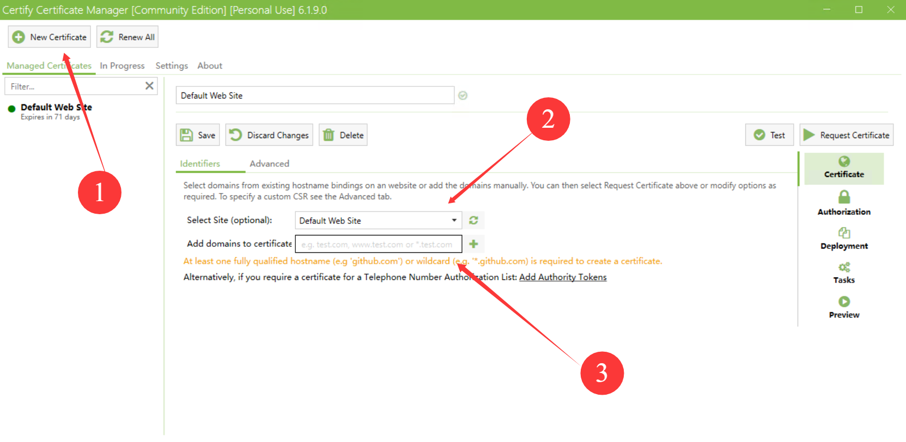

2. 按照下图操作，选择一个认证方式。我选择的是 DNS 验证。这里需要填写 DNS 的 API 的 API Key 和 Key ID 等信息。我的 DNS 服务器使用的是 DNSPod 国内版，这里需要注意的是 DNSPod 的 API 并不是腾讯云子账户的 API.

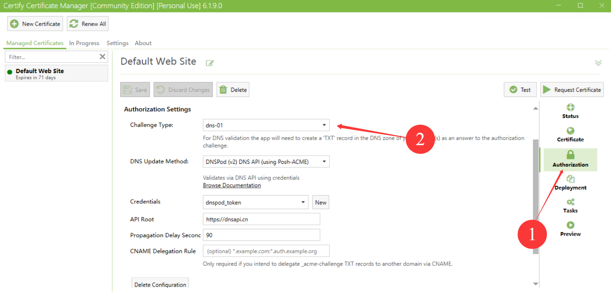

3. 点击 Request Certificate 按钮开始获取证书。

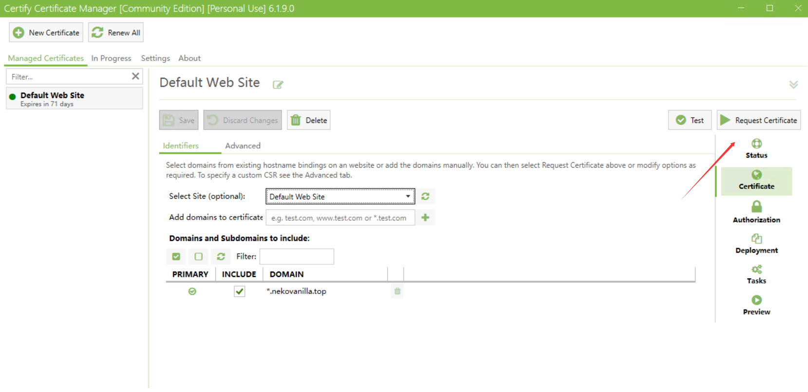

4. 回到 IIS 中，为 IIS 站点添加一个 :443(https) 的绑定，并选择刚刚申请好的证书。

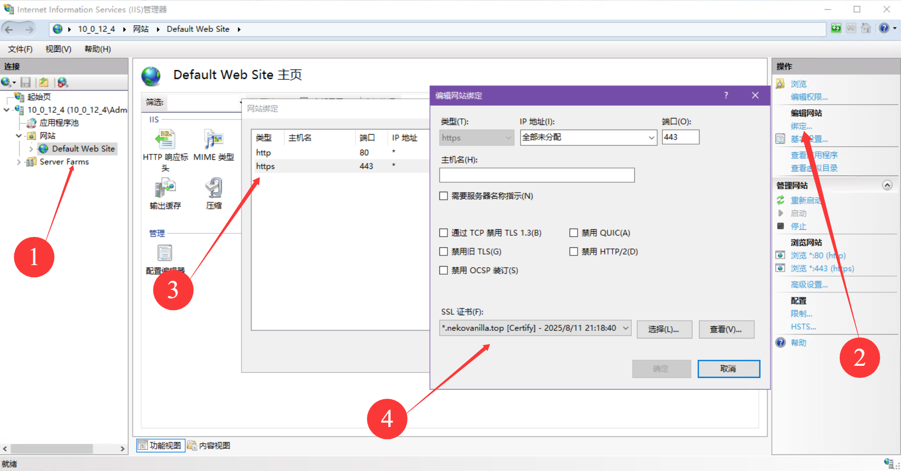

## 反向代理

IIS 中配置反向代理，需要用到 Rewrite 和 Request Router 这两个插件。

这里我主要参考的是[微软官方的这篇文档](https://learn.microsoft.com/en-us/iis/extensions/url-rewrite-module/reverse-proxy-with-url-rewrite-v2-and-application-request-routing).

* URL Rewrite Module 的下载地址：<https://www.iis.net/downloads/microsoft/url-rewrite>

* Request Router 的下载地址： https://www.iis.net/downloads/microsoft/application-request-routing

分别将两个插件安装完成后，刷新下 IIS 管理器，并点击本机的主页（注意不是网站的注意），进入 Application Request ... 的这个图标。按下图图示进入代理配置页面，并启用代理功能。

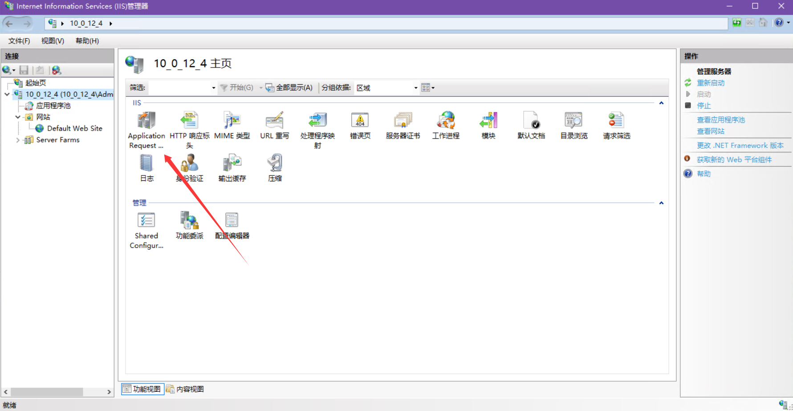

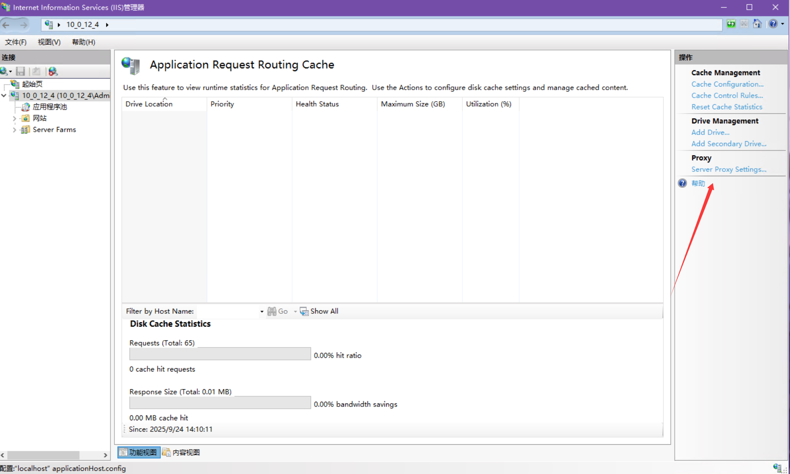

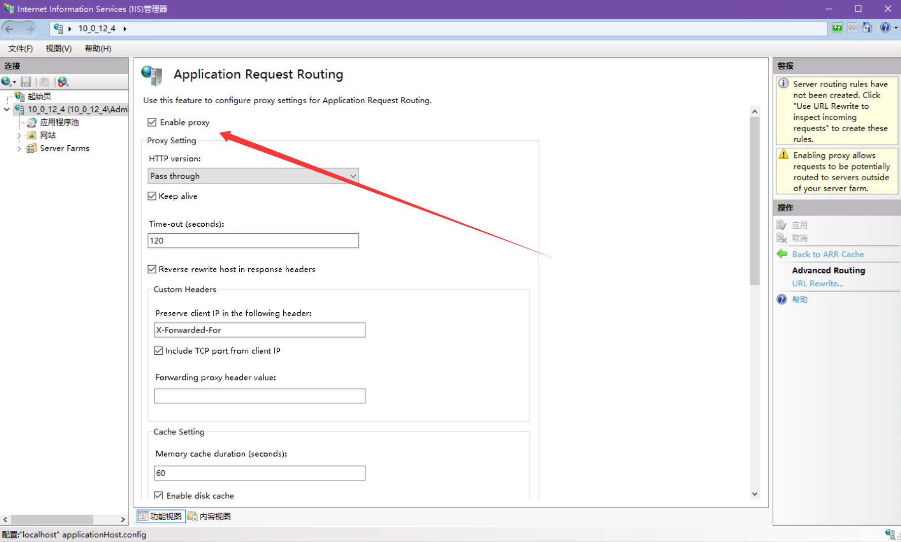

然后回到网站中，双击图标进入 URL 重写界面。

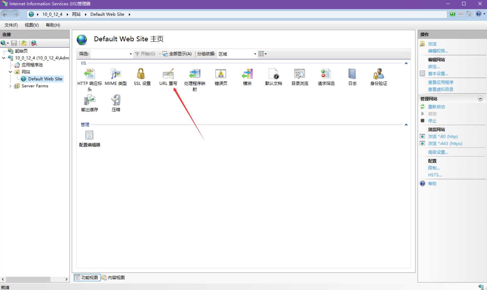

点击右侧的“添加规则”按钮并添加一个反向代理规则。

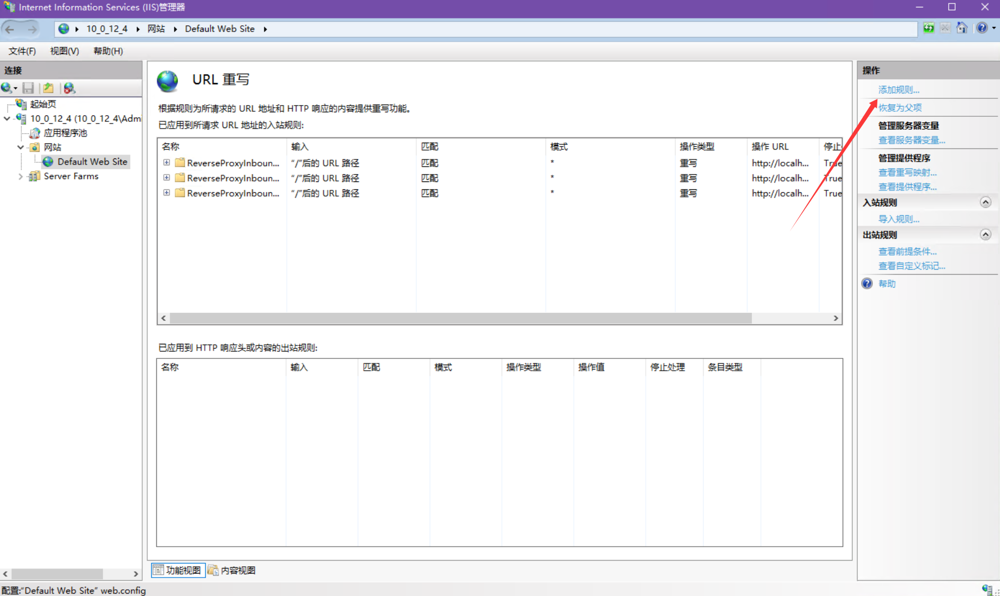

在此页面填写你要转发到的地址+端口

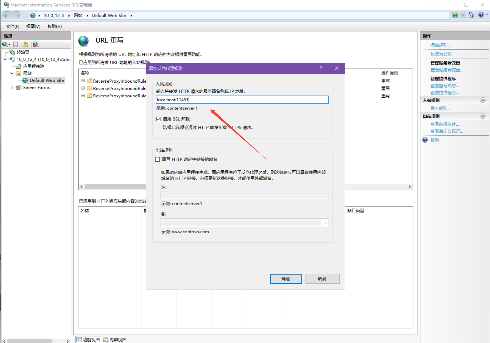

然后进入刚刚创建的规则，这样设置，从而为该规则指定一个合适的主机名（推荐指定，这样可以实现对于不同的主机名转发到不同地址和端口）：

> 条件中输入为{HTTP_HOST} 与模式匹配时，具体模式只填写主机名即可，如`test.example.com`

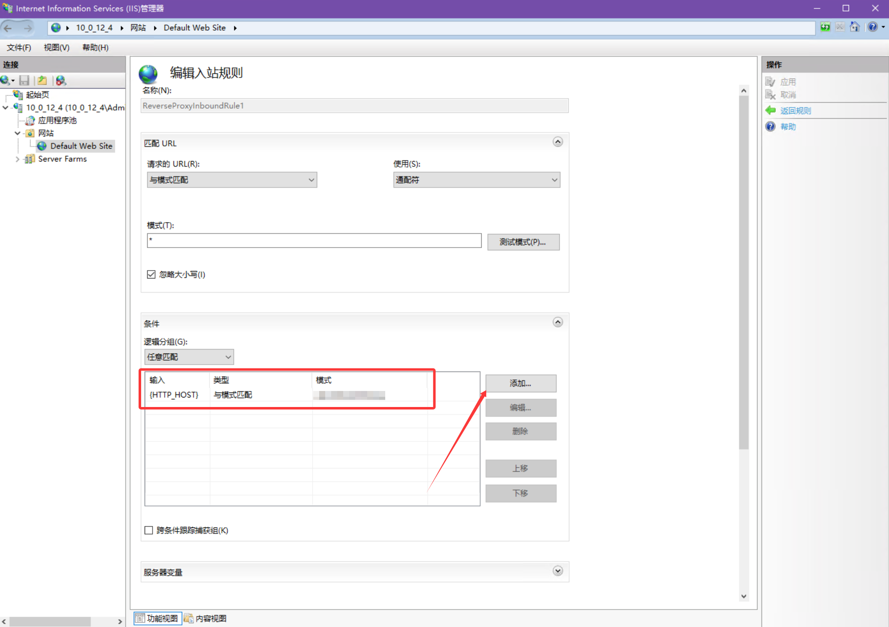

然后将操作这里按下图设置。 重写 URL 设置为 `http://localhost:11451/{R:1}`

11451 代表要转发的端口

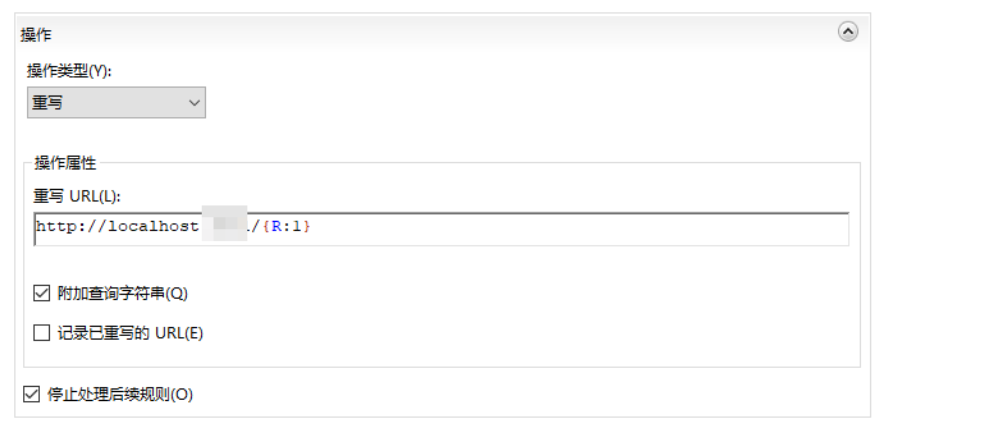

至此，设置完成，可以打开浏览器访问一下看看反代的效果，是否成功之类的。