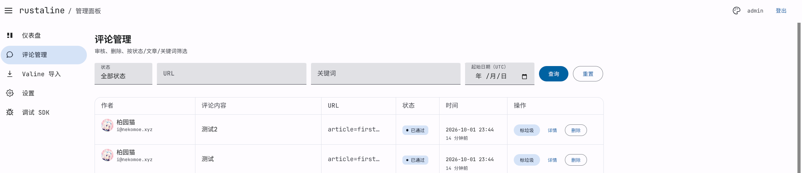
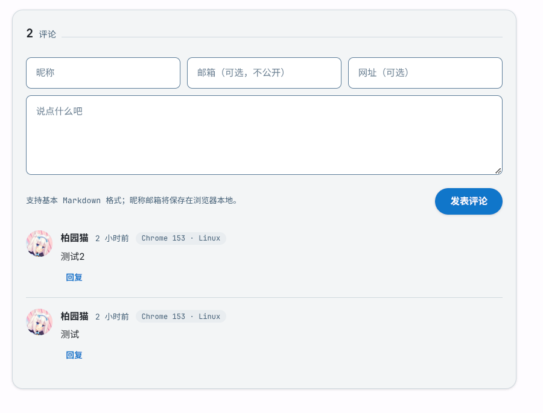

似乎除了年终总结之外，今年还没有发过新的文章。当初创立这个博客的时候我的期望是每月左右更新一篇文章的，不过慢慢地随着各种事情变得更加繁忙而导致博客的更新频率变的越来越低，不过即使是去年，也发表了5篇博客文章，也就是相当于2～3个月左右能产出一篇文章，其实频率已经比我想象的高多了。而今年却一篇博客还没有发过，好在现在这篇文章来了。

从何谈起呢，首先还是老生常谈的 vibe coding吧...

## vibe coding

提到 vibe coding，相信很多人都会有不同的看法，同一个人不同时间段的看法很有可能也不一样，有投降派，有理性派...像大概是今年年初的时候刷到过一个视频，台上的演讲者大概是说了一些以后都用AI开发了程序员会被淘汰的言论，于是台下的应该是程序员的人反驳道，“哪怕用 CC 也好，如果你不能亲自把代码打开来去一行行看，这样做出的产品不仅达不到产品质量而且是不负责任的”，当时我也认为这句话很对，而且当时我即使是用 AI 写的每一行代码，也会仔细地审查。但是现在当时的结论也许也该改变了。就我现在而言，不但我自己已经做不到一行行代码去审查了，而且从观点上我认为配合AI审查和自己对代码全局的一些把握，确实未必需要人工去做审核。

那么在目前这个时间节点去用 vibe coding需要注意什么呢？首先我觉得现在完全vibe一个生产级的项目而无需手写一行代码已经是可行的了，关键是怎么样去用正确的方式去做。作为一个从古法编程时代走过来的程序员，我自然是逐步从传统的古法编程慢慢走过来的。最早是使用 Tab 键在编辑器中补全一些逻辑片段，到后来尝试用 Cline 搭建代码骨架但重要部分人工理解和手写，再到后来使用 Claude Code 指挥一些规则明确的任务，再到现在基本是从零开始用 Harness 边说边实施一个项目，我的理解是线性上升的，并且对以前的古法方式也是逐步平滑替代的，所以相比一开始就接触 vibe coding，我是逐步将传统古法编程中的一些步骤慢慢替换为 Agent 主导的方式，然后这些被替换的步骤越来越多，最终达到了完全的 Agent 编程。而一开始就接触 vibe coding 的人，对代码全局的把握从一开始就是没有的，虽然可以由后天弥补一些知识点（比如什么git如何使用啊，环境变量敏感凭据要如何安全处理等等），但因为没有古法编程时代程序员对代码的全局观以及控制力度，所以我相信古法程序员可以适应AI并提效，但反过来一个只会 vibe coding 的程序员，若不经过勤劳地学习和实践，是未必可以替代古法程序员的。换句话说我认为古法程序员用AI大概率也比只会 vibe coding 的人用的好。

现在说回本文的主题，Rustaline。

### Rustaline 介绍

> Rustaline 是一个基于 Rust 语言，使用 axum 框架与 Sea-ORM 开发的简单评论服务。支持楼中楼与 Gravatar。支持从 Valine 迁移数据。

当然，以上句子摘自我的 [Rustaline GitHub 仓库](https://github.com/baiyuanneko/rustaline)。不过以上只是形而上的描述，而借用《置身钉内》的一句概念，我完成这个项目是有发心的。不过当然我的发心没那么高尚和深刻。了解我的博客的人都知道，我的博客一直都是使用的 Valine 作为评论系统，这个系统使用的数据库是 Leancloud 这个云数据库，而且没有支持其他 alternative(替代性的) 的数据库，然后 Leancloud 27年就会停服了，所以我得再那之前把我博客的评论系统做一个替换。

所以我希望做这么一个评论系统：尽可能简单，可完全自启动而不依赖Serverless或某种特定的云平台、方便单机Docker部署甚至于方便直接裸机运行，并且要尽可能方便从 Valine 迁移，并且至少初期阶段不做 GitHub 登录认证之类的功能，保持纯粹，就是一个和 Valine 的复刻品一样的感觉，保留不做认证的经典体验。

首先是技术栈的选型。

### 保持原型和至少初版简单，即使是通过 vibe coding 开发项目

我最早其实这个项目计划的比现在的目标要宏大的多。因为我自身上班写的语言是 Java，同时这个自 2025 年以来就已经是我自己开发个人项目也用的最多的语言了，因此我最早是打算使用 Java + Spring Boot + Mybatis Plus 去开发。然后要支持多用户、每个用户支持创建和管理多个站点、要支持反垃圾、要支持验证码和敏感词过滤级别设置，要支持组织管理和邀请其他人一起来管理站点评论等，然后计划了半天，数据类和表先建了一大堆，结果功能实现出来即使只是一个草稿版本都很难调试到能运行的状态。于是后面我打算全盘重来了，在这坨石山上要能跑通一个能用的版本可能需要的时间不在我精力可承受范围之内。并且我原来甚至打算主要逻辑我自己手写...

发现这样不可行之后，我打算全盘重来，首先就是目前 vibe-coding 应当已经足够成熟到开发生产级项目了，因此我不如借此机会尝试从零 vibe coding 一个项目，锻炼下自己的 vibe coding 能力。

首先就是技术栈。我当时有两个候选：Golang 和 Rust。这俩当然都是 vibe coding 时代的热门语言，并且我咨询了两位群友 Rikki 和 chihuo2104 关于 Golang 和 Rust 各自的优缺点、特点等等，最终选择了 Rust，有这么几个原因：首先 Rust 的运行性能比 Golang 更好，而都是 vibe coding，不是我自己写，所以开发难度不在我考虑范围内，我直接尝试使用 Rust. 还有一个原因是不是都说 Rust 是 AI Agent 时代的天选语言么。而在体验过后，我也感觉 Rust 十分符合我自己的思考方式，我感觉使用起来十分顺手，包括项目业务配置文件的设置，配置覆盖规则（环境变量>config.toml>default.toml>默认变量值）等的规范来说，我最终感觉自己更倾向于 Rust 语言进行开发。

技术栈选型完毕之后，划定要实现的范围。

### 经过简化的功能范围

我上文也提到了，我的第一版设计因为原型就过于复杂因此难以在合理的时间内去做完整开发，因此这次我吸取教训，只设计了最核心的功能，初版优先将这些核心功能跑通：

* P0-评论后台管理
* P0-评论 SDK
* P0-从Valine导入评论
* P1-验证码防abuse

而目前我发布的第一版 Rustaline 也确实只包含了这些功能。而我这个项目应该是八月中旬左右的时候开始开发的，现在已经10月1号了，表明即使是这些功能也花费我一个半月时间才完成，可见我最开始的目标是多么的不切实际。

我之后还打算实现邮件提醒功能，以及IP记录、阅读统计等功能。不过当然，那些都是之后的事了。它们虽然也都十分重要，但饭总得一口口吃。

然后就是最重要的：Just Do it.

### 干就完了！

我以前很喜欢玩的一个游戏《植物大战僵尸》（其实现在也喜欢玩）里面有一种植物叫做路灯花。它的作用是驱散迷雾，以及在罐子模式中查验周围的罐子中是植物还是僵尸，为下一步的决策提供帮助。事情的全貌当然不是一开始就有的，事情都是越做越清楚的，尤其是一个复杂的事情。可能一开始只是一个模糊的想法，不过慢慢朝着目标迈进的途中，想法才能越来越具象化。所以绝对不能因为事情的全貌没有完成就不去做，万事开头难，如果不做的话，事情永远都没有进展。

举个例子，比如我现在要做一个笔记软件，那我应该怎么开始？难道是先设计清楚所有的功能细节和设计理念？那不成日本IT了（逃）错误的，AI时代，应该先跟AI说：我想要做一个笔记软件，使用 Rust + Sea-ORM 技术栈，你帮我搭建一个基本的框架。

当然不清晰的需求还是先自己搞明白为好，否则 AI 一旦写出来逻辑混乱的代码，后续再调整又越改越乱的风险。这里需求具体细化到什么程度，当然是你能细化到什么程度就细化到什么程度。像我给 AI 沟通就十分仔细，甚至有时会精确到哪个数据对象的哪个字段。

以及最重要的，在发布之前的...

## 安全检查

人尚且会犯错，AI 编写的代码自然也不是“All Perfect”（“完美无缺”）的。要知道软件工程中代码会出现很多漏洞，比如 XSS 啊，SQL 注入等等。而我个人观点，可能只会 vibe 的程序员很难第一时间发现和理解其中的风险。比如我想要让评论支持 Markdown 格式，而本身为了保持前端 SDK 的轻量性我不希望引入 Markdown 解析库。那么如果让 AI 在以上两点前提下完成这个需求，它很可能会自己去手写简单的解析器，然后没有足够地考虑安全，写出一个存在 XSS 漏洞的解析器。这只是一个例子，事实上即使是古法编程程序员，我相信也总有失手的时候，使用 AI 也未必能预判到它所有的写的不完善的地方，因此 Code Review 或者说安全扫描是一定要做的。

例如 Claude Code 似乎就有 Ultra Review 功能。或者直接通过提示词让 AI Agent 进行多轮、多 Agent 进行交叉审查应该也是可行的。这一步一定要用你最强大的 AI 模型。这里也非常感谢 [欧阳淇淇](https://ouyangqiqi.cn/), [HyacinthHaru](https://github.com/HyacinthHaru) 提供 GPT-6 Astra、Claude Fable 5.1、Kimi K3 Max 等模型对本项目进行安全性扫描与 Code Review。

## Rustaline 现状

目前本博客就已经全面替换为 Rustaline 评论系统。它基本上兼容并且可以从 Valine 导入数据，虽然还有很多细节上的不足和缺点，但我认为值得有类似需求的人进行一试了。

↓评论管理后台截图

↓评论区演示截图

* 项目地址：<https://github.com/baiyuanneko/rustaline>
* 项目站点与文档：<https://baiyuanneko.github.io/rustaline>

### 感谢名单

再次感谢 [欧阳淇淇](https://ouyangqiqi.cn/), [HyacinthHaru](https://github.com/HyacinthHaru) 提供 GPT-6 Astra、Claude Fable 5.1、Kimi K3 Max 等模型对本项目进行安全性扫描与 Code Review

再次感谢 mzwing 为本项目的 bbg-next 集成提供 day1 支持

再次感谢 chihuo2104、Rikki 在本项目开发过程中在技术栈选型上进行的探讨。

完整感谢名单见 <https://baiyuanneko.github.io/rustaline/thanks.html>