<info-hint>本文章中含有大量图片（共约 28.8 MB），请注意流量消耗。</info-hint>

坦白地说自大学以来咱就一直处在一个动力不是很足的状态下，不过还是顺利活过了 2023 年，也有很多事情让我开心 或者觉得有意义（

首先是 2023 年咱终于体会到了什么是真正的大学生活，2022 年因为疫情所以几乎什么都干不了，现在看来对我来说影响最大的就是紧闭着的校门导致的不能点外卖或者出去吃，因为学校食堂真的会吃腻（对我来说）而且一些菜确实烧得不好吃。和室友出去吃饭还是很开心的，但是必须承认的一点是即便算是体会到了完全体的大学生活，也与我以前的想象差距不小。比如，大学虽然有很多自由时间和精力，但是不意味着自己就会进入自主学习或者更上进的状态，也就是说拖延症这种问题并不会因为上了大学自行解决（）自控力还在其次，性格或者成长上的进步也需要自己去努力，而不是光是靠更轻松的生活，就觉得这些问题都直接都被解决了。

还有是今年参加了一些 CTF 比赛，作为一个自认为高中生活本身比较无趣（高中没有计算机社团，也没有参加过什么相关比赛）的人来说可以说是第一次的初体验了，不但拿了奖还获得了一笔对我来说数目不算小的奖金，开心（）这里也十分感谢几个队友在比赛过程中对我的帮助（我比较容易紧张）以及在分奖金时候对我的照顾；2023 年一共参加过两次 CTF 和一次 AWD 形式的比赛，还因为这几次比赛的缘故有幸得到了学校的注意，并体验了学校的护网工作。帮大忙了.webp（指参加比赛给我的前途帮大忙了，不要理解成给学校的护网工作帮大忙了，其实摸了很多鱼（

要说参加 CTF 给我成长的最大帮助应该就是意识到了很多事情没有看上去那么难，只要有尝试的勇气和信心。也许就像《星灵感应》里面的火箭那样，开始尝试做了之后才会发现没有自己想象的遥不可及。以前一直以为搞 OI 的大佬或者玩 CTF 的这种人都是大佬中的大佬，现在自己也参加过比赛了也能更客观的看待这些比赛了（）除了 CTF 比赛之外没有参加其他类型的比赛，但是已经报了下一年的 Python 组蓝桥杯，不知道到时候能拿个什么水平的奖。犹豫过要不要报 C/C++ 组但是我比较摸所以不一定能在比赛之前把语言基础学到足够的水平（

年初的时候学了 C#，不过客观来说自己还是用 JavaScript（TypeScript）和 Python 比较多。2023 年写过一个[比较失败的 Web 端 OCR 程序](https://nekomoe.xyz/index.html?type=article&filename=a-failure-in-web-ocr.md) 以及一个技术力比较低的新的[个人主页](https://i.nekomoe.xyz)（用来替代我原先使用的 [amphineko/atomicneko](https://github.com/amphineko/atomicneko)），别的好像也没什么特别的，翻了一下才知道自己还往一些开源仓库水了一些（大概是可有可无的）贡献，我记性也不好可能写过别的也忘了（）这方面做的事情确实没有 2022 年多，主要是缺乏动力以及客观上的技术力下降（？）（

然后是其他的折腾方面，首先是电脑上，目前正在使用的是 Ubuntu 23.10 + GNOME 45.1。在最近我开始有意识地更多地使用开源软件，特别是 LibreOffice。我之前用的比较多的其实是 WPS Office（因为和 MS Office 的兼容性好并且支持 Linux），但是今年开始更多地使用 LibreOffice 了。促使我使用 LibreOffice 的最大原因是 WPS 对 Linux 的支持问题：WPS 不支持 Wayland，所以它的所有文本和按钮在我电脑上看起来都是糊的。另外，FreeType 最近的一次更新导致 WPS 的所有粗体文本都会显示成一大坨黑色的不规则块。总之试着换了一下 LibreOffice，这里我主要担心的是格式兼容问题。不过在我的使用场景（交作业）上，对于 Word 来说，格式与 MS Office 有些许微小的差异其实并不是什么大问题。主要的问题集中在 Excel 上。因为这学期我学了一门有关会计的课，才发现有些 Excel 函数在 LibreOffice 上的行为其实是不同的，所以对于 Excel 来说还是要用 WPS 或者一些其他解决方案。

以及这里想要特别地提一下 Wine 和 Proton。现在的 Wine（Proton） 已经非常强大了，我的 Galgame 几乎都是通过 Wine 运行的，目前很少遇到运行不起来的情况。除此之外我需要用的许多游戏和程序也能通过 Wine 顺利运行，比如说 osu!、网易云音乐客户端等等。

然后是手机上，八月份的时候我人生以来第一次尝试给安卓手机刷机以及 Root。我用的是三星的 Galaxy M30s，这部手机比软好的是解锁 BL 比较方便（三星手机特有的容易解锁，你是一个一个一个，三星手机啊啊啊啊啊啊）；随后尝试用三星的 ROM 刷写工具 OdinFlashTool 将 TWRP 刷写入手机中。（这里插一个小插曲：因为我当时用的是 Linux，不能运行 OdinFlashTool，所以很自然地愁到了开源解决方案（有两个，JOdin 和 Heimdall），然后很轻松地......把手机刷砖了，这里还是建议用 Windows 操作，或者至少在 Windows 虚拟机中使用 USB 直通进行操作，我也不知道为什么 JOdin / Heimdall 会有这种问题 ）。另外，大概是因为用的是国行版本的缘故（因为 PixelExperience 似乎并没有特别为国行版本适配），刷 PixelExperience 的尝试并没有成功，但是最终还是找到了一个比较轻量的 ROM 包刷入了。尝试进行了 Root 并安装了 Magisk，但是因为银行 APP 等不支持 Root，而一些规避方案 （包括使用旧版 Magisk 的 MagiskHide 功能）都会导致系统没法启动，最终作罢。估计是我选择的 ROM 的问题。这里也很感谢 [@Misaka13514] 在我折腾 Android 的时候不厌其烦地不断回答我一些现在看来很蠢的问题（

还有一个想提的就是开始使用 YubiKey 了。YubiKey 是 [@Misaka13514] 三月份的时候送给我的，我目前使用 YubiKey 的用途有两个，一个是将其作为网站的两步验证因素之一，另一个是用它来存储自己的 OpenPGP 私钥。具体的我在[之前的文章](https://nekomoe.xyz/index.html?type=article&filename=2023-5.md)中有写过；以及学习了 DN42 并熟悉了 WireGuard、BIRD2 等软件的使用，还获得了一个不错的 DN42 域名 `neko.dn42`，也是 [@Misaka13514] 解答了许多我的问题。感谢 [@Misaka13514] 在各个方面给我的帮助！

AI 方面的话，自己尝试部署了 Stable Diffusion 并学习了基本使用，~~虽然我用的笔记本是核显本只能用 CPU 演算不过不是不能用~~。用 Stable Diffusion 给我做过的两个开源项目（[这个](https://github.com/bbg-contributors/bbg)和[这个](https://github.com/baiyuanneko/bocchi)生成了图标）。以及因为我平时看的一部分动画是生肉，或者视频语言是日语而没有字幕，想到了使用 [Whisper](https://github.com/openai/whisper) 去生成字幕并丢给 ChatGPT 翻译，效果还不错。

以及，因为 B 站上有很多 AI 翻唱的，于是自己尝试训练了一个小之星海果的 so-vits-svc 模型（仅供我自己个人研究学习使用，不会公开），效果只能说差强人意不过考虑到我的时间和精力有限，自己剪出来的训练数据质量也不是很高所以也不是特别失望。

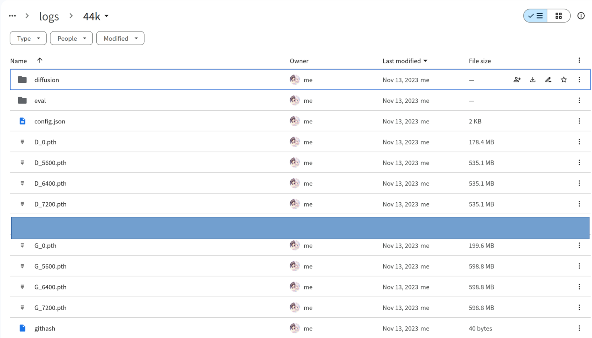

2023 年我开始接触更多游戏~~以及开始给Steam爆金币了~~。2023 年我开始玩的几个在线游戏包括Blue Archive（国服）、赛马娘台服、原神、雀魂麻将等等。赛马娘是因为有点占空间（占了我 10G 甚至 9G）于是没有坚持玩下去。原神我个人觉得还是挺好玩的，原因的话大概是制作精美的二次元风格自机角色 + 清新的渲染风格 + 开放世界 + RPG + 整洁不杂乱的界面 + 我觉得还不错的剧情 这些因素共同叠加产生的奇妙化学反应。不过因为 Linux 上的原神国服使用 Wine 运行经常是处于一个时好时不好的状态所以还是经常是需要使用云原神的。玩 Blue Archive 的主要原因之一是因为之前看到过才羽绿和才羽桃的插画，感觉真的**好可爱好可爱**耶，瞬间被治愈了。虽然也没有抽到全部我想抽的角色，不过剧情比我想象的要更好，比如主线第二章的游戏开发部部分剧情，还是有一种久违的感动感的（至少对我来说）。感谢我的一个同学带我玩 Blue Archive，没人教的话我甚至都不会清体力（）最后就是雀魂麻将了。打了一年麻将，也不能说技术提高了很多，还是很菜，不过抽到了一个有可爱语音的角色（当然别的地方也挺可爱的），好耶。

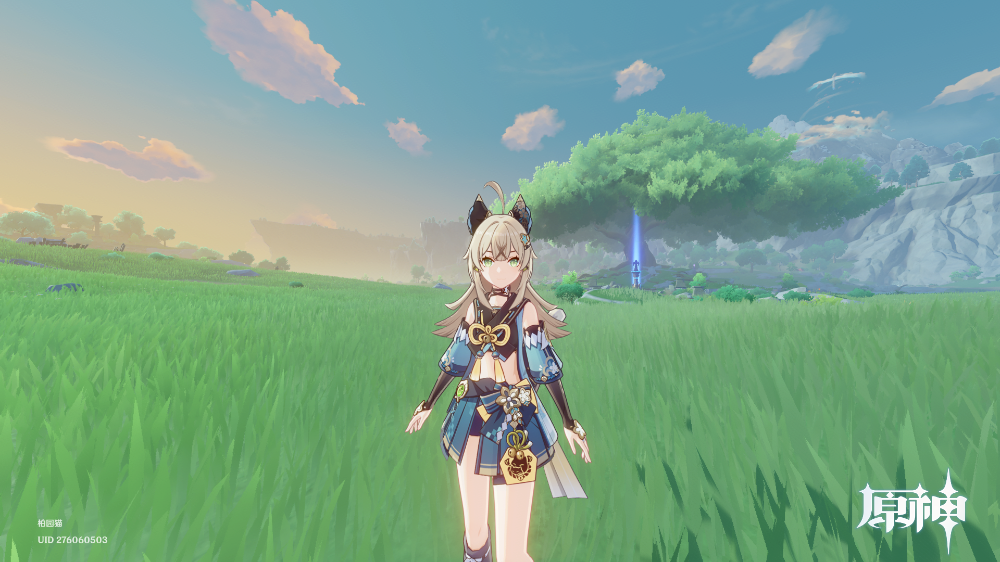

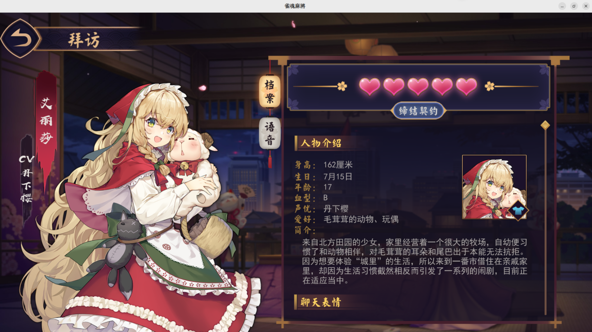

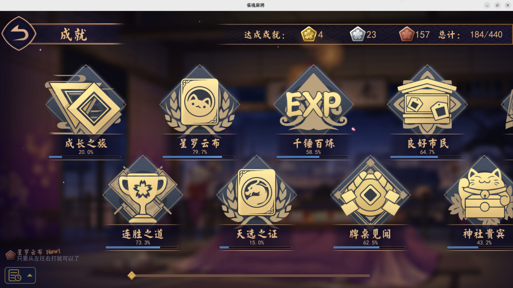

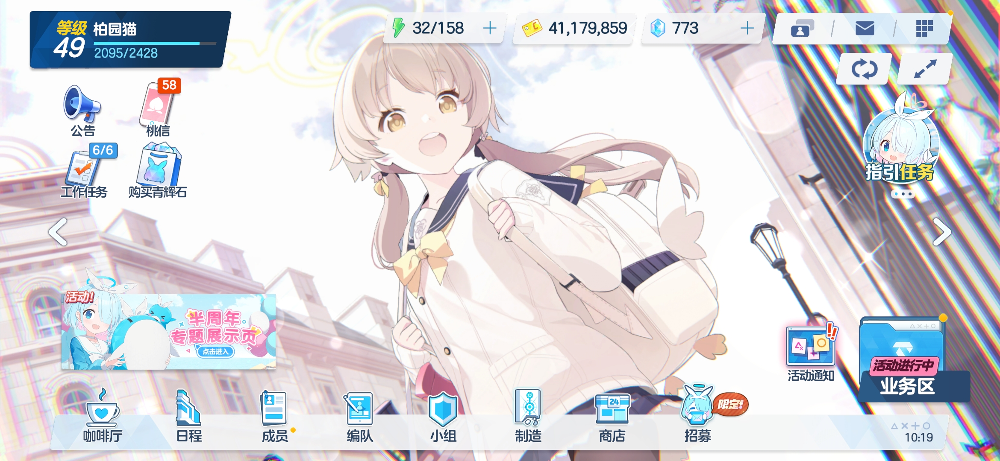

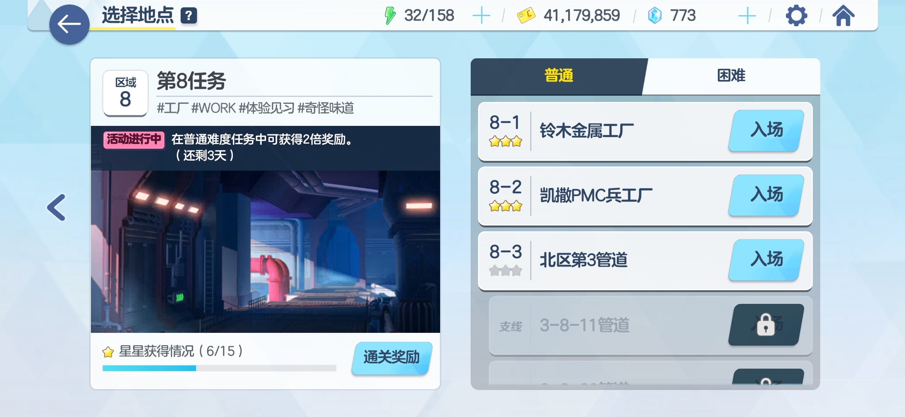

然后是 Steam 上，终于开始买一些游戏了，首先是补票了 NEKOPARA 的全系列，然后买了一直想玩的《主播女孩重度依赖》（不过目前只通关了14/24个结局），然后是买了一些 Galgame （《恋爱绮谭 不存在的夏天》、《恋爱绮谭 不存在的真相》以及对我来说有点贵的《常轨脱离 Creative》），以及《城市：天际线》（但是还没开始玩）这里面对我来说觉得最值回票价的反而是最贵的《常轨脱离 Creative》，几位女主都很可爱，`最享受的一集！.webp` 当然我这个 Steam 库存量也算少的，也不是说要攀比或者什么，只是随便分享一下（（

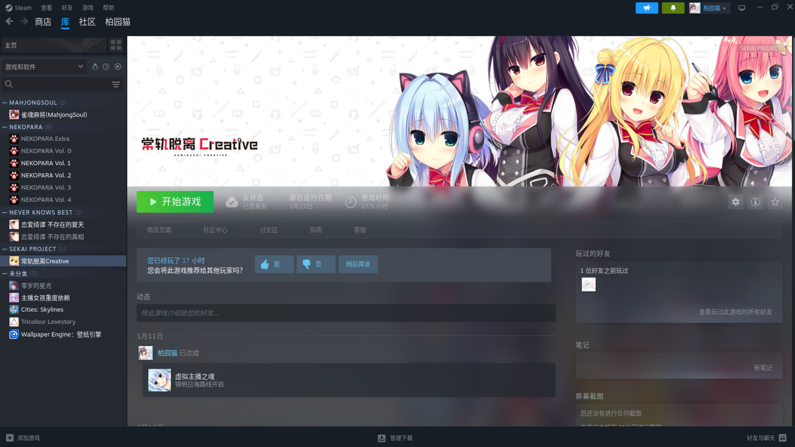

其它游戏方面，玩了《Undertale》、《Getting Over It》之类的一些独立游戏。以及在时断时续地玩着《osu!》（以及《osu!lazer》），我打这个水平不是很高但是消磨时间还是一个不错的选择（以及，很荣幸能把 [@chihuo2104] 拉入 osu! 的坑（x

<info-hint>下面两张图中上面一张是 osu!stable 的个人资料，下面一张是 osu!lazer 的个人资料。</info-hint>

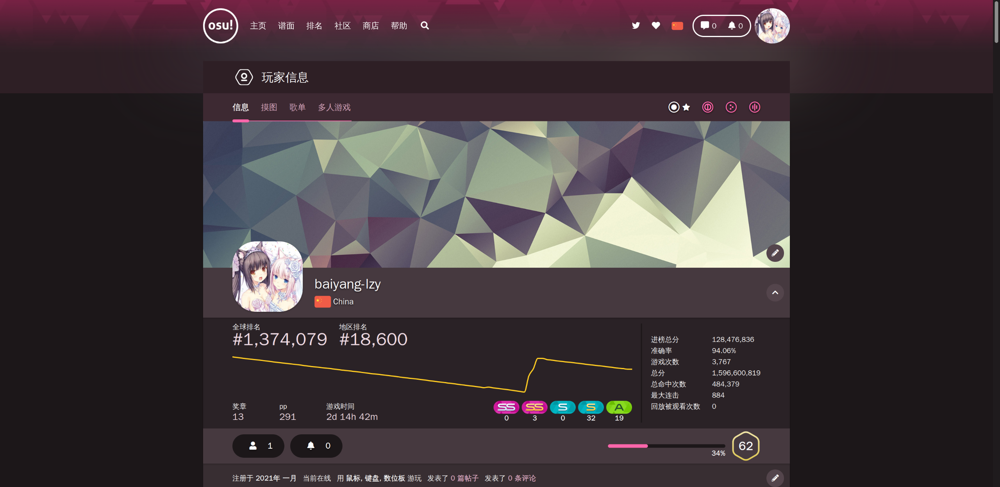

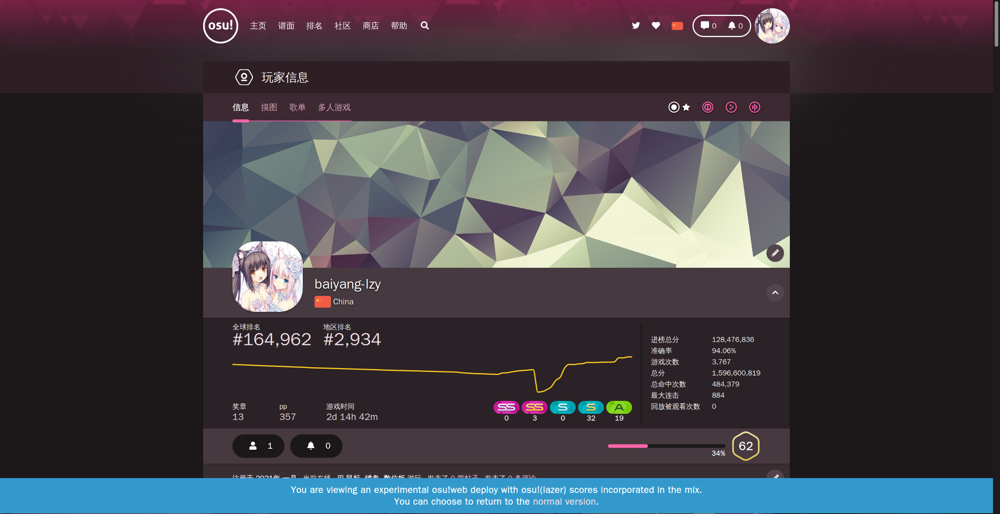

《Minecraft》方面，寒暑假的时候玩了群友开的服务器（

第一次尝试了在 Minecraft 中搭建手办（参考了 [这个视频](https://www.bilibili.com/video/BV1yW411g7ji/)），同时也第一次尝试用 [Minecraft Pixel Art Generator](https://www.scriptolab.com/minecraft-pixel-art-en.php) 在 Minecraft 中绘了图，也感谢 [@Misaka13514] 在绘图过程中的大量帮助。

感谢 [@Misaka13514]、[@scientificworld]、[@chihuo2104]、[@littlebear]、[@mzwing]、[@zzjzxq33]、[@Kolozea]、[@666999HC] 等群友（可能有漏的？）陪我玩 Minecraft！

年底的时候通过 Microsoft Store 入了正。

在这一年里，还和 [@Misaka13514] 和 [@scientificworld] 使用 Syncplay 同步看了 MyGo!!!!! 以及其他许多番剧，我今年大约三分之二的番剧都是通过 Syncplay 和群友 [@Misaka13514] 和 [@scientificworld] 一起看的，感谢你们的陪伴！（

### 音乐相关

感谢 [@chihuo2104] 推荐给我的竹月雨 II 耳机，说是 [@MujiTogawa] 推荐给他的，我用着感觉也很好用。

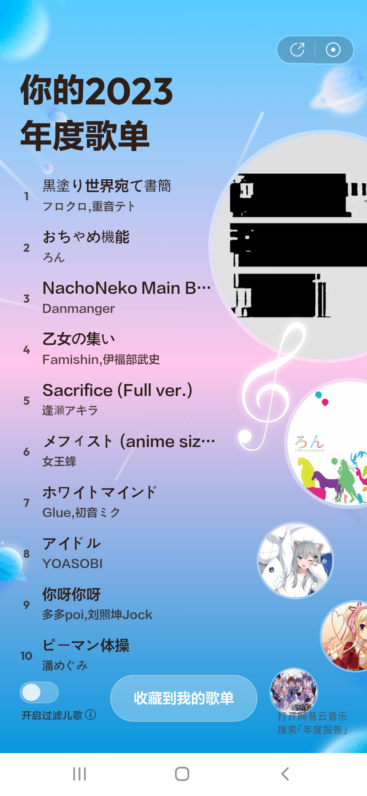

### 小彩蛋 1

Hackergame 2023 临近结束的时候被 [@wlt233] 超力（悲）（雾

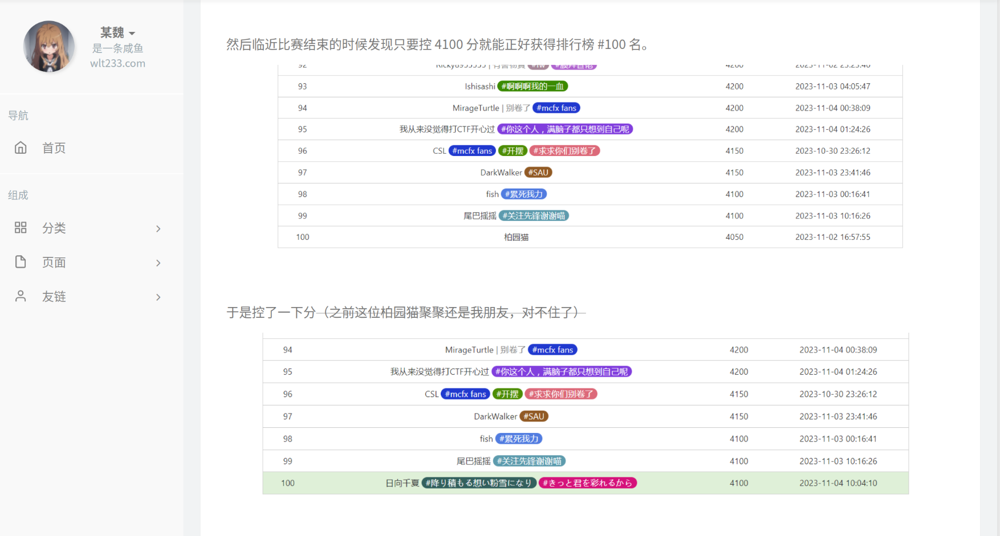

### 小彩蛋 2

只玩了大概一个多小时的 Phigros（）好难（

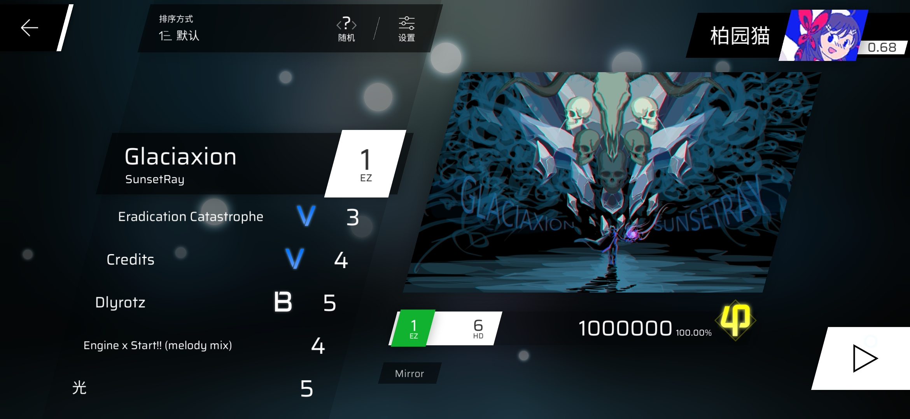

## See also

也可以看看其它人的年终总结：

* [我的 2023 - 欠陥電気の摸鱼小池](https://blog.atri.tk/2023/my-2023/)
* [我的 2023 年终总结 - 无意识の桜](http://koishi514.moe/blog/bbg/index.html?type=article&filename=s5e6TSCZKQXW.md)
* [小碎记20231209 - 洛仙璃の幻梦](https://mzwing.eu.org/index.html?type=article&filename=small-article-20231209.md)
* [Byebye 2023(或 17岁再见) - 木屐落在水洼了](https://mjt.asia/posts/ed8b190a/)
* [2023年度总结 - chihuo2104の部落格](https://blog.chihuo2104.dev/posts/goodbye-2023)
* [【碎碎念】某魏的 2023 年度总结](https://tqlwsl.moe/index.php/archives/2778/)
* [SekaiMoe 的 2023 - SekaiMoe's World](https://sekaimoe.dpkg123.site/end-of-2023/)
* [2023的总结 - CC米饭](https://www.ccrice.com/neworld/761/2023%e7%9a%84%e6%80%bb%e7%bb%93/)

## 结语

希望自己能在新的一年里技术力越来越高，也祝正在看这篇文章的读者新年快乐！

[@Misaka13514]: https://blog.atri.tk/
[@scientificworld]: https://koishi514.moe/
[@chihuo2104]: https://blog.chihuo2104.dev/
[@littlebear]: https://littlesunnybear.com/
[@mzwing]: https://mzwing.eu.org/
[@zzjzxq33]: https://github.com/zzjzxq33/
[@Kolozea]: https://kolozea.top
[@666999HC]: https://space.bilibili.com/516252009/
[@MujiTogawa]: https://mujitogawa.github.io/
[@wlt233]: https://tqlwsl.moe/