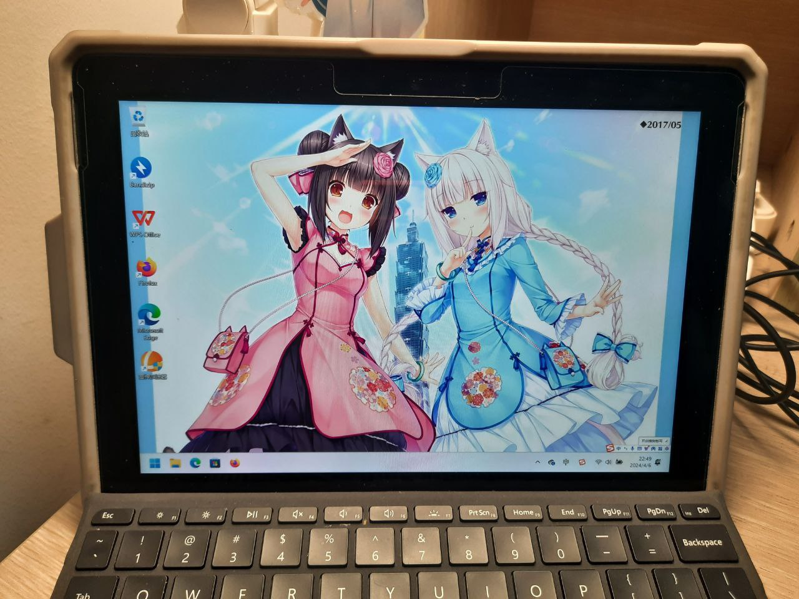
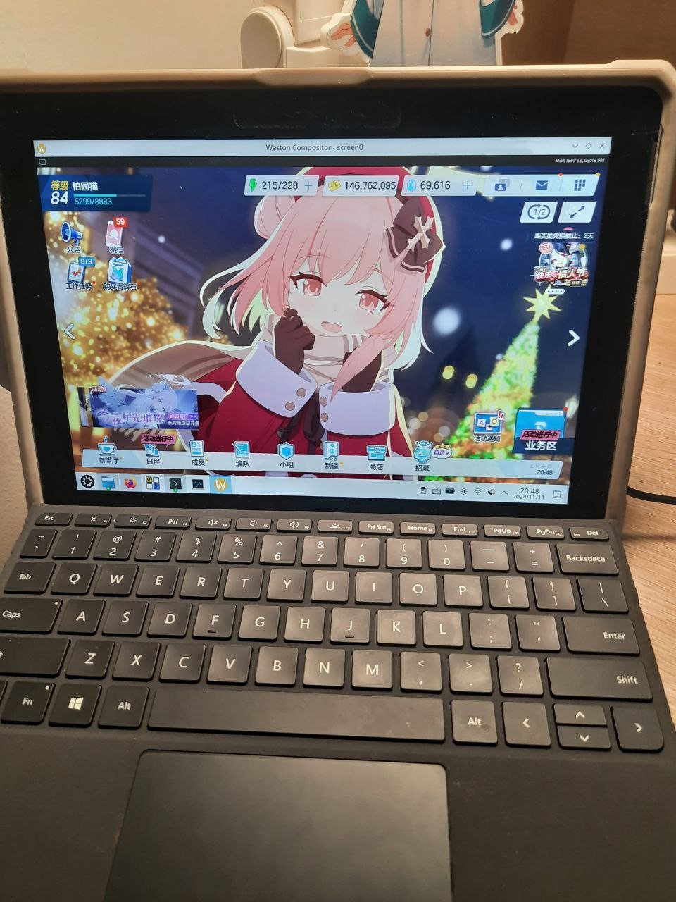
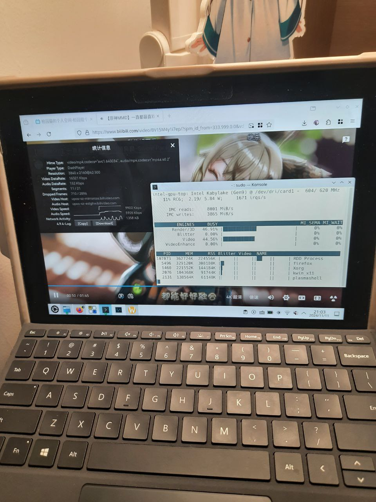
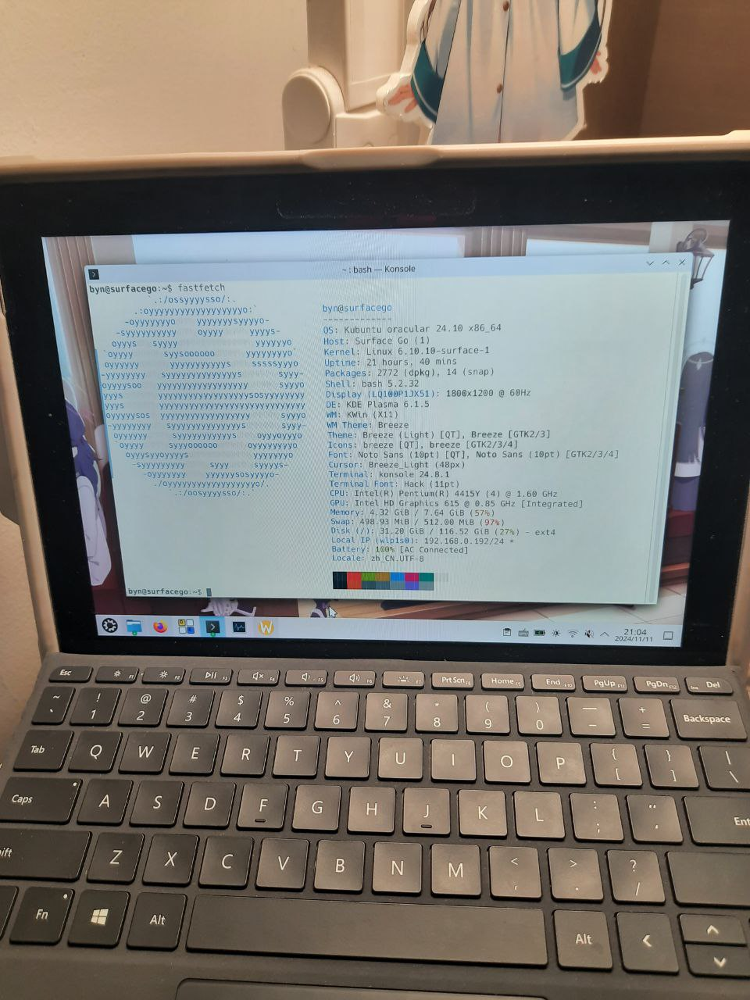

虽然已经忘记了自己第一次使用平板电脑是什么时候，不过我还记得自己第一次拥有属于自己的平板电脑是一台 iPad mini 2. 那是在我小学的时候，我父母买给我的。这也几乎是我第一次接触苹果设备。再之后，应该是初中的时候，因为 iPad mini 的电池寿命已尽，我父母给我换了 iPad（不过现在已经忘记是第几代型号了）。那时候我折腾过些什么呢？越狱嘛，虽然尝试过不过失败了，毕竟当时欠缺相关知识而且技术力不够。对当时的印象只有陪伴我折腾苹果设备的爱思助手/iTools这种第三方工具了。不过令人羞愧的是我用爱思助手最大的作用只用来免费下载盗版软件。而且，假如让我重生到初中重新开始使用苹果设备，现在的我也不屑于把这种第三方的商业软件安装到自己的设备上了。

iPad 的体验当然没得说：相比 Android 平板显著更好的生态、统一的体验、性能尚可的配置，这些都是 iPad 相比别家的优势。不过我是从没觉得做果粉有意思过。虽然现在我什么粉都不是，但如果让我在做果粉和软粉中选择一项，我大概会选择后者。觉得微软的生态有意思对我来说大抵是从初中开始的。彼时微软刚刚推出 Windows 8，当微软的 Windows 8 把科技感满满的 Metro 磁贴设计广而告之的时候，这个设计风格对于一个当时沉浸在 Win7 Aero 效果中的小孩哥（其实就是我）的震撼是无以言表的。换句话说这也可以说是给我对软件 UI 设计和扁平化风格的启蒙吧。

从那时起我便梦想着有一台 Surface——我记得当时微软商城官网挂着的是经典的 Surface Pro 3，宣传视频和贴吧里吧友的使用体验看得我眼馋不已，但是毕竟父母已经给我买了 iPad，因此我是无缘体验到了。时光飞速流转，我已经步入大学两年了，经过各种机缘巧合，我在 [chihuo2104](https://chihuo2104.dev) 的推荐下收了一台成色尚可的 Surface Go 一代。虽然现在的我已不是软粉，也不再执着于折腾各种系统了。

> 当我在寝室里打开了闲鱼收的二手 Surface Go 时，脑海中总会想起 10 年前第一次给电脑安装 Windows 8 的那个遥远的下午.

## Overview

## 二合一合一合一虎视眈眈

非常幸运的是，我的这台 Surface Go 并不是 4GB 的低配版，而是配备了 8GB 内存和键盘的高性能版本。卖家甚至贴心地送了一个 SD 卡。有了键盘，意味着这是一个二合一设备。Surface Go 的键盘采用磁吸式设计，不用时可以取下键盘，使用的时候再安上。如果取下了键盘，或者把键盘放到了后盖上，则自动进入平板模式，默认可以调出屏幕键盘。尽管 Win11/Win10 的工作重点并不在平板适配上，但是仍然保留了这些方便的功能。值得一提的是，作为运行着 Windows 的设备，生态主要以 Win32 应用程序为主。为触屏优化过的程序并不是很多，大多数在触屏环境下只能将就使用甚至艰难使用，甚至包括微软自家的一些应用（例如在平板模式下 VS Code 会频繁触发屏幕键盘，难以正常使用）。当然，UWP 应用的触屏体验确实良好，但目前 UWP 应用很多也已不再更新，换句话说，由于 Windows 应用生态对触屏的支持并不良好，像 iPad 那样买前生产力、买后爱奇艺的现象并不一定会出现——买前爱奇艺、买后生产力还差不多。

## 熙熙攘攘我们的云游戏

作为一台配置在今天来看稍显落后的设备，它只能用来玩玩 Galgame 吗？事实上，我们甚至可以玩原神！当然，是使用云游戏串流方案。

我尝试过的云游戏平台主要有米哈游云原神和网易云游戏。假如你尝试从它们的官网下载客户端然后运行，你一定会发出“我们的应用生态确有问题！”的感叹。没错，因为上面提到过的原因，这些客户端根本不支持触屏操作。怎么解决呢？如果你看过 B 站上那些在各种奇妙的地方（比如作业帮应用）里打开原神的视频，你会注意到它们都是利用云原神网页版进行的，而且完全是可玩的。这是因为云原神网页版对 Android UA 做了触屏适配，但客户端没有。网易云游戏也是差不多的情况。所以答案就是去浏览器里找个改 UA 的插件，然后用 Android UA 访问网页版的云原神/网易云游戏即可使用触屏享受云游戏了。

## Windows is All you need...?

Surface Go 预装的是 Windows 10 系统。到手之后，我迫不及待的安装了 Windows 11，并安装了各种应用，然后收获了一个无比卡顿的系统。

卡顿指的是以下几点：（1）应用打开时间长。由于 CPU 性能孱弱和 Win11 对于老设备糟糕的优化，打开软件可能需要耗费很长的时间，即使 Surface Go 配备的是 SSD.（2）开机时间长。许多应用喜欢设置开机启动项，如果你忘记取消它们，再与第一点的原因叠加起来，开机启动可能会耗费非常长的时间。（3）应用切换会有明显迟滞感，尤其是当内存占用非常大的时候。比如你同时在使用浏览器和文件管理器和一些其他应用，从任何一个切换到另一个都会有卡顿的感觉。

当然 Surface Go 是老设备，我不是故意安装 Win11 的，求求你回到 Win10 好不好，我什么都愿意做的！

## The Happy Path

我并不想装回 Win10，但我也不能再忍受 Win11 的卡顿了。于是从没给电脑以外的设备安装过 Linux 的我在前几天开始了尝试。

我尝试的发行版是 Kubuntu 24.10。怎么安装呢？答案是：和给电脑安装 Linux 一样的安装。Surface Go 虽然看上去是一台平板电脑，但它其实更像一台笔记本电脑。它可以非常方便的进入 BIOS 设定页面和修改启动项，也可以关闭安全启动然后调整为从 U 盘启动，剩下的步骤相信都不用说了。值得一提的是，Surface Go 只有一个 Type C 的口，如果你打算在 U 盘中烧录安装镜像的话，需要提前准备好转接头。

关于 Surface 如何进入 BIOS 并修改启动项，可以参考这篇文章：<https://support.microsoft.com/en-us/surface/how-to-use-surface-uefi-df2c8942-dfa0-859d-4394-95f45eb1c3f9>

### 更换到 Surface Kernel

在完成发行版的安装之后，可以考虑更换到 Surface Kernel.

GitHub 上有一个项目 [linux-surface/linux-surface](https://github.com/linux-surface/linux-surface)，其中提供了适用于 Surface 的 Linux Kernel。即使不用这个 Kernel，基本功能仍然可以正常使用。不过这个 Kernel 提供了对于一些驱动的更好支持，例如摄像头。

可以参考这个教程安装 Surface Kernel：<https://github.com/linux-surface/linux-surface/wiki/Installation-and-Setup>

### 摄像头支持

安装完成后，你可能会发现摄像头不能正常使用。这时可以参考这篇教程：<https://github.com/linux-surface/linux-surface/wiki/Camera-Support>

### 触摸屏、屏幕键盘与图形系统

虽然我一直主张应该尽量使用 Wayland，不过目前我并没有成功在 KDE Wayland 下成功处理好屏幕键盘的支持。我尝试了 Maliit Keyboard，但是并没有找到成功调出这个键盘的方法，Fcitx 5 似乎有一些 Virtual Keyboard UI，但是都需要编译安装使用。

目前我使用的是 X11 图形系统配合 OnBoard 实现屏幕键盘。在任何时候，OnBoard 的屏幕键盘都不会自动弹出，你需要手动点击托盘图标或任务栏快捷方式进行运行。

Firefox 在 X11 下默认不支持触摸屏。可以参考 <https://superuser.com/questions/1151161/enable-touch-scrolling-in-firefox> 这篇教程解决。

### 运行 Android 应用和游戏

目前 Linux 下流行的安卓模拟器有 Genymotion、Waydroid 和 xDroid. 我推荐使用 Waydroid.

Waydroid 只占用一点点内存，而且性能开销并不大，并且有良好的触屏支持。安装一个 Android 模拟器也可以极大地改善应用生态问题。

如果你正在使用 Wayland 图形系统，直接参考官方教程安装即可：<https://docs.waydro.id/usage/install-on-desktops>

如果你像我一样正在使用 X11 图形系统，那么就需要一些其他的小技巧了。关键在于我们如何在 X11 下模拟 Wayland 的环境。~~由于 Wayland 下的 X11 兼容层被称作 xwayland，根据乘法交换律可知 X11 下的 Wayland 兼容层叫做 waylandx...~~才怪！我们应该怎样模拟 Wayland 环境呢？方法有几种。（1）使用 cage. 我们可以安装软件包 `cage` 然后执行 `cage -- waydroid show-full-ui`.（2）使用 `kwin-wayland`. 我们可以执行 `kwin_wayland "waydroid show-full-ui"`。（3）使用 Weston. 我们需要先安装 Weston，然后在终端中执行 `weston`。这时会在单独的窗口中打开 Weston 混成器。这个窗口内容的左上角有一个终端的图标，点击一下即可打开 Weston Terminal. 在 Weston Terminal 中执行 `waydroid show-full-ui` 即可。

我个人使用的是第三种方法。如果 Waydroid 的界面和字体看上去有点小，进入 Waydroid 的系统设置中的 Display and brightness 中有一个 Display Size，向上调高两格即可。

为了方便没有用过 Waydroid 的人，这里简单介绍一些使用技巧：

首先 Waydroid 是可以安装 Google Play 框架和商店的。如果在一开始的初始化阶段选择了 VANILLA 镜像也没事，后期还可以通过 waydroid_script 手动安装。

然后需要记住几条重要的 Waydroid 命令。`waydroid session start`和`waydroid session stop`是用来打开和结束当前会话的。比如如果你需要重启 Waydroid，就可以先 stop 再 start. 还有一条是 `waydroid show-full-ui` 是用来显示 Waydroid 实际窗口的。

然后就是用 Waydroid 几乎必备的 waydroid_script 了。它的地址在这里：<https://github.com/casualsnek/waydroid_script>. 它有非常多的功能，包括安装 Google Play 框架和商店啊，还有安装 ARM 兼容层之类的。

Waydroid 不自带 ARM 兼容层。因此，在运行一些程序时，会遇到困难。这时候需要安装一个 ARM 兼容层。这个有两种选择，一是 libndk，二是 libhoudini. 我使用的是 libhoudini. 因为我玩 Blue Archive. BA 这个游戏的特点就是用 libndk 运行会报游戏资源错误，而使用 libhoudini 又会在启动页面闪退。幸运的是，libhoudini 会使游戏在启动页面闪退的问题是有 patch 可以解决的，但 libndk 不能。

首先使用 waydroid_script 安装 libhoudini，然后下载这个 patch 并应用即可：<https://github.com/waydroid/waydroid/issues/788#issuecomment-2162386712>

### Hardware-accelerated video decode

视频硬解应该可以 work out of box. 可以安装 `intel-gpu-tools` 然后运行 `sudo intel_gpu_top` 观察这一点。

## 再次喜欢上 Surface Go 吧！

Surface Go 上的 Linux 体验应该说是不错的，特别是响应速度和卡顿问题相对来说进行了比较好的解决。曾经我由于卡顿而吃灰的 Surface Go 又重新焕发了生机！

标题 neta 自游戏《ISLAND》的章节小标题之一，没有什么特别的含义（

